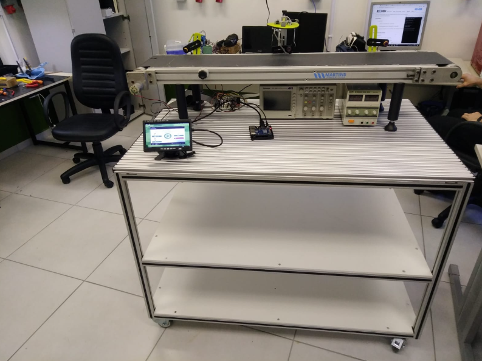

Controle de velocidade com telemetria e acionamento remoto da esteira transportadora do laboratório LPAE
#####################################################################

.. contents::
   :local:
   :depth: 2

Requisitos
**********

Este projeto foi implementado com o módulo esp32-s3, de início foi utilizado o driver L298N, enquanto o driver que foi desenvolvido não estava pronto. O motor da esteira é um do tipo dc brushed, o sensor utilizado para medir foi o sensor de velocidade encoder óptico LM393, que possui 20 ranhuras e são necessárias duas fontes de alimentação, uma para alimentar o diretamente o driver de 24V e outra para alimentar o regulador de 5V. 

Na parte de firmware foram implementados os módulos motor.c e wheel.c, que são responsáveis respectivamente por gerar o sinal PWM e fazer a aquisição da leitura do encoder. A main.c é responsável pela conexão wifi e envio de dados para o cliente python por meio de comunicação COAP, além de chamar e criar as tarefas e funções que serão utilizadas;

Visão geral
***********

Este projeto consiste no desenvolvimento de um sistema de controle de velocidade para uma esteira acionada por um motor DC, utilizando o microcontrolador ESP32. O sistema permite ao usuário definir a velocidade desejada pelo computador, enquanto um sensor realiza a medição da velocidade real do motor. Com base nessas informações, o controlador ajusta o sinal PWM aplicado ao motor, garantindo um controle preciso.

O desenvolvimento foi divido em quatro etapas:

- Etapa 1: Nesta etapa, foi realizado o estudo do microcontrolador ESP32, tipo do sensor que será utilizado, a comparação entre rampa de aceleração linear e rampa em S e o diagrama de blocos do sistema, permitindo a visualização geral do funcionamento do projeto.

- Etapa 2: Na Etapa 2, foram realizados testes individuais com os sensores que serão utilizados com o microcontrolador, e o desenvolvimento dos esquemáticos dos hardwares do sistema. 

- Etapa 3: Foi implementada a leitura do encoder utilizando o periférico PCNT corretamente, feito os layouts da PCI do driver que foi feito, foram desenvolvidos os firmwares responsáveis pelo acionamento do motor através do driver L298N e um programa preliminar para testar a comunicação COAP, além de fazer o projeto e implementação inicial de um controlador PID que será aplicado na esteira.

- Etapa 4: Por fim, na última etapa, foram integrado os códigos que antes estavam separados, como a parte de leitura do sensor, acionamento da esteira e comunicação COAP, além do teste final da esteira controlada já usando o driver desenvolvido e o monitoramento sem fio do sistema, onde é possível setar uma velocidade e o sistema devolve o valor do PWM atual, velocidade atual e o erro entre a medida e setada.

Configuração
************

As principais configurações do sistema remetem a parâmetros como os ganhos integrador e derivativo do controlador e seu período de amostragem, o duty cycle mínimo e o máximo e a definição do encoder

Parâmetros do controlador PI:

.. code:: C

   #define TS_CONTROLE_S       0.1f

   #define KP_PI               4.0f
   #define KI_PI               42.0f

Limites do PWM:

.. code:: C

   #define DUTY_MIN            0.0f
   #define DUTY_MAX            1023.0f
   #define DUTY_MIN_MOVIMENTO  300.0f

Configuração do encoder:

.. code:: C

   #define ENCODER_GPIO        14
   #define PULSOS_POR_VOLTA    20

Interface do usuário
********************

O controle remoto da esteira é realizado por uma aplicação desenvolvida em Python.

Os comandos disponíveis são:

- **on**
    Liga a esteira utilizando uma referência padrão.

- **off**
    Desliga a esteira.

- **rpm**
    Realiza uma única leitura da velocidade atual.

- **monitor**
    Exibe continuamente:

    - velocidade de referência;
    - velocidade medida;
    - erro de controle;
    - duty cycle aplicado;
    - sentido de rotação.

- **fwd**
    Define o sentido direto de rotação.

- **rev**
    Define o sentido reverso de rotação.

- **q**
    Encerra a aplicação

Compilando e executando
***********************

Para compilar o projeto:

1. Instale o ESP-IDF
2. Importe os arquivos do projeto 
3. Configure a placa ESP32-S3.
4. Execute: Build no projeto
 

Testando
********

Após gravar o firmware no ESP32:

1. Monte o sistema com as conexões previstas.

2. Verfique se o IP que aparece no terminal do esp-idf corresponde ao que está no scipt python.

3. Execute o programa Python.

4. Informe uma referência de velocidade.

5. Utilize o comando **monitor** para acompanhar a resposta do sistema com controlador.

6. Aplicando uma carga sobre a esteira é possível ver o comportamento e monitorar o PWM e o duty cycle que está sendo transmitido pelo prompt.

