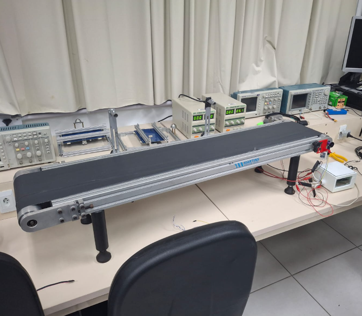

Controle de velocidade com telemetria e acionamento remoto da esteira transportadora do laboratório LPAE
#####################################################################

.. contents::
   :local:
   :depth: 2

Visão geral
***********

Este projeto consiste no desenvolvimento de um sistema de controle de velocidade para uma esteira acionada por um motor DC, utilizando o microcontrolador ESP32. O sistema permite ao usuário definir a velocidade desejada pelo computador, enquanto um sensor realiza a medição da velocidade real do motor. Com base nessas informações, o controlador ajusta o sinal PWM aplicado ao motor, garantindo um controle preciso.

O projeto foi dividido em quatro etapas principais:

- `Etapa 1 <etapa_1/README.md>`_

Nesta etapa, foi realizado o estudo do microcontrolador ESP32, tipo do sensor que será utilizado, a comparação entre rampa de aceleração linear e rampa em S e o diagrama de blocos do sistema, permitindo a visualização geral do funcionamento do projeto.

- `Etapa 2 <etapa_2/README.rst>`_

Na Etapa 2, foram realizados testes individuais com os sensores que serão utilizados com o microcontrolador, e o desenvolvimento dos esquemáticos dos hardwares do sistema. 

- `Etapa 3 <etapa_3/README.rst>`_

Foi implementada a leitura do encoder utilizando o periférico PCNT corretamente, feito os layouts da PCI do driver que foi feito, foram desenvolvidos os firmwares responsáveis pelo acionamento do motor através do driver L298N e um programa preliminar para testar a comunicação COAP, além de fazer o projeto e implementação inicial de um controlador PID que será aplicado na esteira.

- `Etapa 4 <etapa_4/README.rst>`_

Por fim, na última etapa, foram integrado os códigos que antes estavam separados, como a parte de leitura do sensor, acionamento da esteira e comunicação COAP, além do teste final da esteira controlada já usando o driver desenvolvido e o monitoramento sem fio do sistema, onde é possível setar uma velocidade e o sistema devolve o valor do PWM atual, velocidade atual e o erro entre a medida e setada.

Interface do usuário
********************

O controle remoto da esteira é realizado por uma aplicação desenvolvida em Python.

Os comandos disponíveis são:

- **on**
    Liga a esteira utilizando uma referência padrão.

- **off**
    Desliga a esteira.

- **rpm**
    Realiza uma única leitura da velocidade atual.

- **monitor**
    Exibe continuamente:

    - velocidade de referência;
    - velocidade medida;
    - erro de controle;
    - duty cycle aplicado;
    - sentido de rotação.

- **fwd**
    Define o sentido direto de rotação.

- **rev**
    Define o sentido reverso de rotação.

- **q**
    Encerra a aplicação

