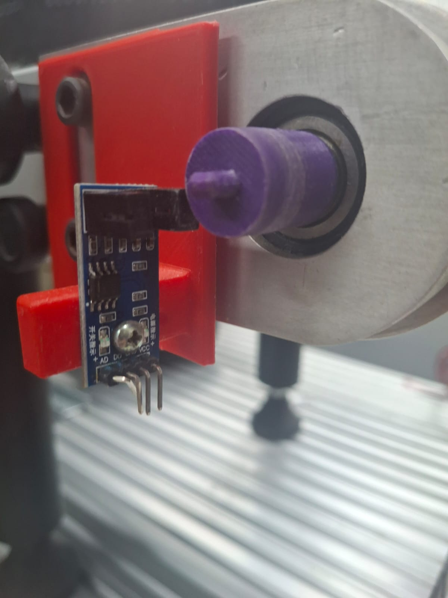

# Etapa 1

- Visão Geral
- Desenvolvimento
  - Diagrama de blocos do sistema
  - Estudo e configuração do ESP IDF para aplicar no projeto
  - Definição do sensor de efeito hall
  - Rampa de aceleração linear ou rampa em S
- Referências

## Visão geral

A etapa 1 consiste numa fase de estudo para o desenvolvimento do projeto. As atividades a serem desenvolvidas nesta etapa são:

📌 Estudo e configuração do ESP IDF para aplicar no projeto

📌 Definição do sensor de efeito hall

📌 Rampa de aceleração linear ou rampa em S

📌 Diagrama de blocos do sistema 

## Desenvolvimento

### 1. Diagrama de blocos do sistema

**Descrição dos Blocos:**

**Celular:** 

O celular é responsável por permitir a interação do usuário com o sistema. Através dele, é 
possível definir a velocidade desejada da esteira e visualizar, em tempo real, os dados de 
funcionamento, como a velocidade atual medida. 

**Controlador (ESP32):** 

O controlador é o elemento central do sistema, responsável por realizar o processamento 
das informações. Ele compara a velocidade desejada, enviada pelo celular, com a 
velocidade real medida pelo sensor, calculando o erro do sistema. A partir desse erro, o 
controlador gera um sinal PWM para ajustar a velocidade do motor. Além disso, realiza a 
comunicação com o celular e o tratamento dos dados provenientes do sensor. 

**Driver do Motor:**

O driver é responsável por fazer a interface entre o ESP32 e o motor. Ele recebe o sinal 
PWM do controlador e fornece a corrente necessária para o acionamento do motor, 
permitindo o controle da velocidade da esteira de forma eficiente. 

**Motor:**

O sistema utiliza um motor DC escovado (Brushed DC Motor), responsável por converter 
energia elétrica em movimento mecânico para acionar a esteira. Sua velocidade é 
controlada por meio da variação do sinal PWM aplicado, permitindo ajuste contínuo da 
rotação. 

**Esteira:** 

A esteira é o sistema a ser controlado. Seu movimento depende diretamente da atuação do 
motor, em que ela será controlada 

**Sensor:**

O sensor será responsável por medir a velocidade de rotação do motor. Os dados serão enviados ao ESP32, permitindo calcular a velocidade da esteira e realizar o controle em malha fechada.

### 2. Estudo e configuração do ESP IDF para aplicar no projeto

O ESP32 é um microcontrolador desenvolvido pela Espressif Systems, utilizado em sistemas embarcadas, especialmente em projetos e prototipagem. Sua popularidade se deve a fatores como baixo custo, ampla disponibilidade no mercado, facilidade de implementação e elevada integração de recursos em um único dispositivo.
Entre as características que tornam o ESP32 interessante, é a conectividade sem fio integrada, incluindo Wi-Fi, o que elimina a necessidade de módulos externos para comunicação em rede, o que simplifica o desenvolvimento de sistemas que precisem se comunicar.

O ESP32 está disponível em diversas versões e variações de hardware, incluindo diferentes módulos e placas de desenvolvimento. Neste projeto, será utilizada a versão ESP32-S3, ele oferece capacidade de processamento, suporta diferentes núcleos, disponibilidade de memória e recursos voltados ao processamento de dados. Além de que é capaz de executar simultaneamente tarefas de controle e comunicação, como a implementação de algoritmos de controle e a troca de dados via rede.

Para o desenvolvimento deste projeto, será utilizada a placa de desenvolvimento baseada no módulo ESP32-S3-WROOM-1 N16R8, que integra o sistema em um único encapsulamento contendo o chip ESP32-S3, memória flash e, dependendo da versão, PSRAM.
O módulo é montado em uma placa de desenvolvimento que realiza a adaptação dos terminais do encapsulamento original (SMD – Surface Mount Device) para um formato com furos metalizados (PTH – Plated Through Hole), permitindo sua conexão em soquetes e protoboards no padrão DIP (Dual In-line Package), facilitando a prototipagem e integração com outros circuitos.
A placa de desenvolvimento também incorpora uma camada de máscara de solda (solder mask), responsável por proteger as trilhas condutoras contra oxidação, curto-circuitos e interferências do ambiente externo, contribuindo para maior confiabilidade do sistema.

Além disso, diversos circuitos auxiliares são integrados à placa, reduzindo a necessidade de componentes externos. Entre eles, destacam-se:

- Regulador de tensão responsável pela conversão de 5 V para 3,3 V, necessário para alimentação do microcontrolador;
- Circuitos de proteção elétrica;
- Botões de controle, como reset (reinicialização) e boot (modo de programação);
- LEDs indicadores de funcionamento;
- Interface de comunicação com o computador via USB, geralmente implementada por meio de um conversor USB-UART;
- Sistema de antena integrado ou conector para antena externa, dependendo da versão do módulo.

A Figura 1 apresenta a placa de desenvolvimento utilizada neste trabalho, enquanto a Figura 2 ilustra o diagrama de blocos correspondente.

A Figura 3 apresenta o diagrama de pinos da placa baseada no módulo ESP32-S3-WROOM-1 N16R8. Nela são ilustradas as principais conexões elétricas disponíveis, incluindo os pinos de entrada e saída digital (GPIO), interfaces de comunicação, alimentação e funções especiais.
Observa-se que os pinos GPIO são multiplexados, podendo assumir diferentes funções conforme a configuração do firmware, como conversão analógico-digital (ADC), sensores capacitivos (touch), interfaces de comunicação serial (UART), comunicação I2C e SPI, além de suporte a sinais PWM.

A imagem também mostra os pinos dedicados a funções específicas, como USB, interface de depuração JTAG, além dos pinos de alimentação (3,3 V e 5 V) e terra (GND). Adicionalmente, são indicados pinos de boot e controle, utilizados durante o processo de inicialização e programação do dispositivo.
Esse tipo de representação é fundamental pois permite identificar corretamente os pinos e periféricos a serem utilizados no desenvolvimento do projeto.

A Figura 4 apresenta uma visão geral da arquitetura interna do módulo, destacando seus principais blocos, incluindo unidades de processamento, circuitos de radiofrequência, periféricos, módulos de segurança e subsistemas de baixo consumo.
No bloco de processamento e memória, observa-se a presença de um processador dual-core, acompanhado de memória SRAM, ROM, cache e a matriz de interrupções, responsável pelo gerenciamento eficiente de eventos assíncronos.

O bloco de radiofrequência (RF) inclui os componentes necessários para comunicação sem fio na faixa de 2,4 GHz, como receptor, transmissor, sintetizador de frequência e circuitos de oscilação, sendo responsável pela implementação das funcionalidades de Wi-Fi. 
Os periféricos constituem uma parte significativa do sistema, incluindo interfaces de comunicação como UART, SPI, I2C e USB, além de módulos especializados como MCPWM (controle de motores), LED PWM, temporizadores de uso geral, contadores de pulso, ADCs e interfaces para câmera e display. Esses recursos permitem a integração direta com sensores, atuadores e dispositivos externos, reduzindo a necessidade de circuitos adicionais.

Outro bloco relevante é o subsistema RTC (Real-Time Clock), que inclui memória dedicada, unidade de gerenciamento de energia (PMU) e um coprocessador de ultra baixo consumo (ULP). Esse conjunto permite a operação em modos de baixo consumo energético.
Em especial, destaca-se o modo de deep sleep, no qual a maior parte dos blocos do sistema, como CPU, periféricos digitais e circuitos de radiofrequência, é desativada, permanecendo ativos apenas os módulos pertencentes ao domínio RTC. Na Figura 4, esses elementos são representados em destaque mais escuro, indicando sua capacidade de operar durante o modo de baixo consumo.
Esse modo é interessante em aplicações que demandam operação contínua com restrição de energia, permitindo que o sistema permaneça inativo por longos períodos e seja reativado por eventos específicos, como temporizadores, sinais externos ou interrupções do subsistema RTC.

### 3. Definição do sensor de efeito hall

Essa atividade tem por objetivo definir o sensor de velocidade do motor. Desse modo o microcontrolador terá o rpm do motor e decidirá se é necessário aumentar ou diminuir a corrente do driver do motor para que o motor gire na rotação pré-determinada.

Inicialmente iríamos utilizar o encoder as5600, que utiliza o efeito hall, e por isso o nome desta atividade ficou definição do sensor de efeito hall. Porém o mais indicado para o nosso uso é o encoder óptico de arduino.

O encoder as5600 utiliza vários sensores de efeito hall para gerar uma posição angular do campo magnético. Então um ímã em determinada posição gerará um equivalente de tensão que é então convertido para um número binário com resolução de 12 bits e isso indicará a posição em graus que o ímã(fonte geradora de campo magnético) está.

Abaixo está um gif do funcionamento desse sensor:

Como pode ser visto, girando o ímã, acende os leds equivalentes à posição em que o ímã girou.

E para obter o rpm do motor utilizando o as5600, primeiro é necessário ler continuamente o valor de posição angular fornecido pelo sensor. Esse valor é disponibilizado via comunicação I2C como um número inteiro entre 0 e 4095, que representa uma volta completa de 360 graus. Em seguida, deve-se armazenar duas leituras consecutivas do ângulo, uma anterior e outra atual, separadas por um intervalo de tempo conhecido. Com essas duas medições, calcula-se a variação angular subtraindo o valor anterior do atual. Como o sensor trabalha em escala circular, é necessário corrigir possíveis descontinuidades quando ocorre a passagem de 4095 para 0 (ou vice-versa), ajustando a diferença somando ou subtraindo 4096 quando o valor ultrapassar metade da escala.

Após obter a variação angular corrigida, converte-se essa diferença em número de voltas dividindo o resultado por 4096. Em seguida, divide-se esse valor pelo intervalo de tempo entre as medições, obtendo-se a velocidade em rotações por segundo. Por fim, multiplica-se esse resultado por 60 para converter para rpm. Esse processo deve ser repetido continuamente para acompanhar a variação da velocidade do motor ao longo do tempo, sendo recomendável aplicar algum tipo de filtragem ou média para reduzir ruídos e oscilações na medição.

#### Encoder óptico

Um encoder óptico usa um LED contínuo e um fotossensor separados por um disco com ranhuras que gira com o eixo.
Quando as ranhuras passam, a luz é alternadamente bloqueada/liberada, gerando um sinal digital (0 e 1).
Cada ranhura corresponde a um pulso, permitindo contar quantos “passos” de rotação ocorreram.
Ele possui dois canais (A e B) defasados entre si (quadratura).
Essa defasagem permite determinar o sentido de rotação e aumentar a resolução da medição.
Para o cálculo do rpm: o encoder gera pulsos conforme o eixo gira, onde cada pulso representa uma fração da rotação.
Conta-se o número de pulsos em um intervalo de tempo conhecido usando o microcontrolador.
Divide-se pelos pulsos por volta e converte-se para minutos, obtendo o rpm.

#### Escolha entre encoder as5600 e encoder óptico

O microcontrolador a ser usado será o esp idf. O ESP32 possui o periférico de hardware PCNT (Pulse Counter), um contador de pulsos. Então escolhendo o encoder óptico o esp contará os pulsos do encoder automaticamente sem sobrecarregar a CPU.
Isso permite medições de RPM mais precisas e confiáveis, mesmo em altas velocidades.
Além disso, integrado ao ESP-IDF com FreeRTOS, facilita a leitura periódica e o controle em tempo real do motor.

Referência do esp, comprovando a existência do pcnt.

Por isso a melhor escolha para medir o rpm do motor é o **encoder óptico**, pois se aproveita da arquitetura do microcontrolador e as contas para cálculo do rpm são mais simples do que com o as5600.

#### Posicionamento do sensor

A imagem abaixo mostra uma possível localização do encoder óptico no sistema:

  

### 4. Rampa de aceleração linear ou rampa em S

O soft start é a técnica de partida suave do motor, onde o PWM (ou tensão/corrente) é aumentado gradualmente ao invés de aplicar valor máximo instantaneamente.
Ele é necessário na esteira porque a carga pode variar (peso), e uma partida brusca gera picos de corrente, trancos mecânicos e desgaste.
Sem soft start, o motor pode sofrer quedas de tensão, aquecimento e até perda de controle de velocidade inicial.

Para implementar, usa-se uma rampa no sinal de controle (PWM), aumentando-o ao longo do tempo até atingir o valor desejado.
Essa rampa pode ser baseada em tempo ou em referência de RPM, usando o encoder como feedback.

Os principais tipos são:

**Rampa Linear:**

Uma rampa de aceleração linear é uma maneira mais simples de controlar a variação de velocidade em motores. A velocidade tem um aumento com o tempo, o que resulta numa aceleração constante.

No gráfico de velocidade pelo tempo, que é uma rampa, a reta crescente mostra que a velocidade do motor aumenta de forma uniforme até atingir o valor desejado. Enquanto no gráfico de aceleração possui um valor fixo durante seu intervalo, tendo uma mudança brusca no início e no fim.

Esse tipo de rampa apresenta descontinuidade no início e no fim, onde a aceleração sofre uma variação brusca. Essa variação pode causar impactos mecânicos, picos de corrente e até a perda de controle de velocidade inicial. 

**Rampa em S:**

A rampa em S é usada para garantir transições mais suaves na variação de velocidade do motor. A aceleração não é constante, variando de forma gradual ao longo do tempo.
Seu gráfico de velocidade tem o formato de “S”, onde a velocidade tem um início e um fim suave. A aceleração tem um comportamento de crescer gradualmente até um valor máximo e retornar a zero. 

Esse comportamento elimina descontinuidades, reduzindo significativamente esforços mecânicos, vibrações e picos de corrente.

Portanto, embora a rampa linear seja mais simples de implementar, ela pode causar impactos indesejados no sistema, enquanto a rampa em S, é capaz de oferecer uma variação mais suave de velocidade, melhorando o desempenho de controle do sistema.

O sistema a ser controlado é a velocidade de uma esteira, por meio do feedback do sensor de velocidade. Portanto será utilizado a rampa em "S", já que contribui para uma melhor estabilidade e precisão, além de ter uma melhor resposta dinâmica do sistema, limita a corrente de partida e melhora a estabilidade com carga variável. Garantindo um controle e acionamento suave do motor.
A principal vantagem desse perfil está no controle do jerk, que representa a taxa de variação da aceleração. Na rampa em S, o jerk é limitado e contínuo, evitando variações bruscas na aceleração. As curvas de jerk abaixo mostram esse comportamento da variação da aceleração, sendo vermelho a rampa linear e em laranja em S.

### Referências

ESPRESSIF SYSTEMS. ESP32-S3 Datasheet. [S.l.]: Espressif Systems, 2023. Disponível em: https://documentation.espressif.com/esp32-s3_datasheet_en.pdf. Acesso em: 30 mar. 2026.

ESPRESSIF SYSTEMS. ESP32-S3-DevKitC-1 User Guide v1.0. Disponível em: https://docs.espressif.com/projects/esp-dev-kits/en/latest/esp32s3/esp32-s3-devkitc-1/user_guide_v1.0.html. Acesso em: 31 mar. 2026. 

DYNAPAR. Encoder: funcionamento. Disponível em: https://dynaparencoders.com.br/encoder-funcionamento/. Acesso em: 29 abr. 2026. 

DYNAPAR. Encoder óptico: comparativo com encoder magnético. Disponível em: https://dynaparencoders.com.br/encoder-optico-comparativo-com-encoder-magnetico/. Acesso em: 29 mar. 2026. 

AUTOMAÇÃO GLOBAL. Como funcionam os encoders. Disponível em: https://www.automacaoglobal.com.br/como-funcionam-os-encoders. Acesso em: 29 abr. 2026. 

VOLTIMUM BRASIL. Soft Starter: O que é? Como funciona? E quais são as vantagens ao utilizá-las? Disponível em: https://www.voltimum.com.br/artigos/noticias/soft-starter. Acesso em: 01 abr. 2026. 

LEWIN, Chuck. S-curve motion profiles: vital for optimizing machine performance. Performance Motion Devices, 11 maio 2025. Disponível em:https://www.pmdcorp.com/resources/type/articles/get/s-curve-profiles-deep-dive-article?utm_source=chatgpt.com. Acesso em: 01 abr. 2026. 

