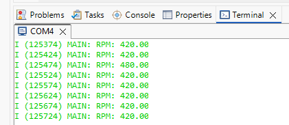
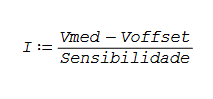
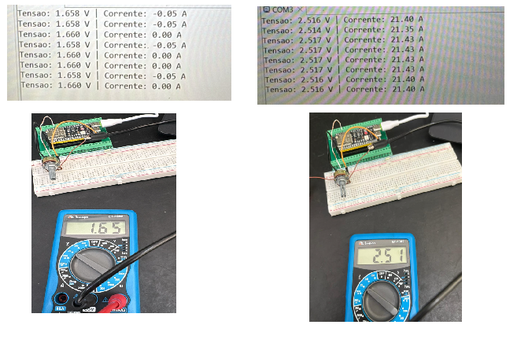
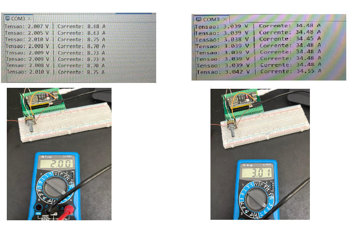
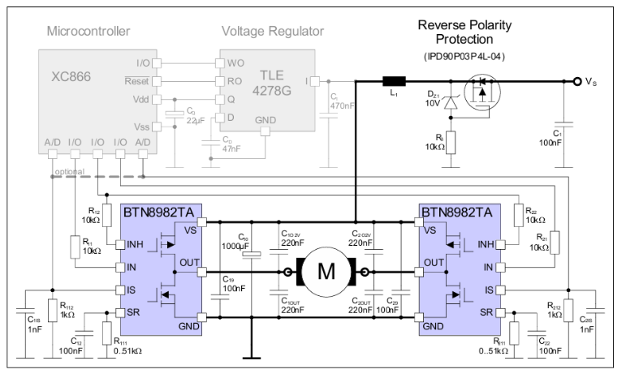
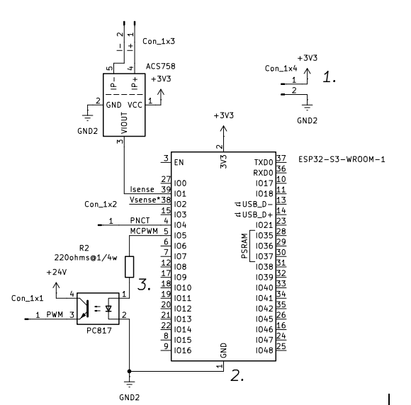

Etapa 2
#######

.. contents::
   :local:
   :depth: 2

Visão geral
***********

Na Etapa 2, foram realizados testes individuais com os sensores que serão utilizados com o microcontrolador, e o desenvolvimento dos esquemáticos dos hardwares do sistema. As atividades desenvolvidas nesta etapa são:

📌 Teste do encoder óptico no microcontrolador

📌 Teste do sensor de corrente no microcontrolador

📌 Esquemátco da placa de potência

📌 Esquemátco da placa de controle

Desenvolvimento
***************

Teste do encoder óptico no microcontrolador.
======

O código do encoder óptico foi realizado com base no código disponibilizado pelo Professor Matheus Leitzke Pinto no “RôboJuca”. Então foi reaproveitada a lógica e estrutura do código wheel.c e wheel.h. Foram mantidas as funções “wheel_Init” e “wheel_GetEncoderPulses”. 

Mudanças no código precisaram ser feitas para adaptar ao nosso encoder, pois o código disponibilizado usa um encoder com quadratura. Dois sinais são gerados, um com um sinal adiantado em relação ao outro. O nosso só utiliza um canal, gera um pulso com 1 quando o sinal passa pela ranhura. 

Então o “wheel_init” faz a configuração do pcnt e o “wheel_GetEncoderPulses” retorna o valor atual do contador pcnt. Como pode ser observado nos códigos abaixo: 

wheel.h

.. code-block:: vhdl

   #ifndef MAIN_WHEEL_H_
   #define MAIN_WHEEL_H_
   
   #include "driver/pulse_cnt.h"
   
   // Pino do encoder (D0)
   #define ENCODER_GPIO  14
   
   void wheel_Init(void);
   void wheel_GetEncoderPulses(int *pulsos);
   
   #endif   

wheel.c

.. code-block:: vhdl

   #include "wheel.h"
   #include "esp_log.h"
   #include "esp_err.h"
   
   static const char *TAG = "WHEEL";
   
   static pcnt_unit_handle_t pcnt_unit = NULL;
   
   void wheel_Init(void)
   {
       ESP_LOGI(TAG, "Inicializando PCNT...");
   
       pcnt_unit_config_t unit_config = {
           .low_limit  = -32768,   // obrigatório
           .high_limit = 32767,
           .flags = {
               .accum_count = true, // obrigatório
           },
       };
   
       ESP_ERROR_CHECK(pcnt_new_unit(&unit_config, &pcnt_unit));
   
       pcnt_channel_handle_t chan = NULL;
   
       pcnt_chan_config_t chan_config = {
           .edge_gpio_num = ENCODER_GPIO,
           .level_gpio_num = -1, // encoder simples (D0), só borda de subida
       };
   
       ESP_ERROR_CHECK(pcnt_new_channel(pcnt_unit, &chan_config, &chan));
   
       // Conta na borda de subida
       ESP_ERROR_CHECK(pcnt_channel_set_edge_action(chan,
           PCNT_CHANNEL_EDGE_ACTION_INCREASE,
           PCNT_CHANNEL_EDGE_ACTION_HOLD));
   
       // Mantém comportamento estável
       ESP_ERROR_CHECK(pcnt_channel_set_level_action(chan,
           PCNT_CHANNEL_LEVEL_ACTION_KEEP,
           PCNT_CHANNEL_LEVEL_ACTION_KEEP));
   
       // Filtro de ruído
       pcnt_glitch_filter_config_t filter_config = {
           .max_glitch_ns = 2000,
       };
   
       ESP_ERROR_CHECK(pcnt_unit_set_glitch_filter(pcnt_unit, &filter_config));
   
       ESP_ERROR_CHECK(pcnt_unit_enable(pcnt_unit));
       ESP_ERROR_CHECK(pcnt_unit_clear_count(pcnt_unit));
       ESP_ERROR_CHECK(pcnt_unit_start(pcnt_unit));
   
       ESP_LOGI(TAG, "Encoder inicializado (D0)");
   }
   
   void wheel_GetEncoderPulses(int *pulsos)
   {
       if (pcnt_unit == NULL) {
           ESP_LOGE(TAG, "pcnt_unit NULL!");
           *pulsos = 0;
           return;
       }
   
       esp_err_t err = pcnt_unit_get_count(pcnt_unit, pulsos);
   
       if (err != ESP_OK) {
           ESP_LOGE(TAG, "Erro ao ler PCNT: %s", esp_err_to_name(err));
           *pulsos = 0;
       }
   }

Na main é printado o valor do rpm no terminal do espressif. Esse valor é calculado com base no número de pulsos do contador do pcnt menos o valor do número de pulsos do contador do pcnt anterior. Este valor então é divido por “PULSOS_POR_VOLTA”, que nada mais é que o número de ranhuras do disco encoder: 20 ranhuras, 20 pulsos é uma volta. E então esse valor é dividido por 0,1. Porque a tarefa de printar no terminal o valor do rpm só acontece de 100ms em 100ms. E por fim é multiplicado tudo por 60 para dar o valor em RPM. Isso pode ser observado no código da main.c abaixo:

Main.c

.. code-block:: vhdl

   #include <stdio.h>
   #include <stdio.h>
   #include "freertos/FreeRTOS.h"
   #include "freertos/task.h"
   #include "esp_log.h"
   #include "wheel.h"
   
   static const char *TAG = "MAIN";
   
   // Encoder com 20 ranhuras
   #define PULSOS_POR_VOLTA 20
   
   void app_main(void)
   {
       ESP_LOGI(TAG, "Iniciando sistema...");
   
       wheel_Init();
   
       int last_pulsos = 0;
   
       while (1)
       {
           int pulsos;
   
           wheel_GetEncoderPulses(&pulsos);
   
           int delta = pulsos - last_pulsos;
           last_pulsos = pulsos;
   
           float dt = 0.05; // 100 ms
   
           float rpm = (delta / (float)PULSOS_POR_VOLTA) * (60.0 / dt);
   
           ESP_LOGI(TAG, "RPM: %.2f", rpm);
   
           vTaskDelay(pdMS_TO_TICKS(50));
       }
   }

Para validar o código foi realizado uma montagem do esp32s3 juntamente com o encoder óptico. E o disco do encoder óptico foi acoplado a um motor DC disponibilizado no LPT. Conforme a figura abaixo: 

.. image:: Imagens/Teste_encoder2.jpg
   :width: 400px
   :align: center

Para saber se o valor calculado do rpm pelo esp32 está condizente com o valor do rpm do motor girando foi utilizado um osciloscópio. Com isso é possível verificar a frequência do sinal de D0 do encoder, ou seja, os pulsos que o encoder gera ao passar pela ranhura. Conforme a figura retirada pelo osciloscópio abaixo mostra: 

.. image:: Imagens/Teste_encoder1-osc.png
   :width: 400px
   :align: center

Então como é possível observar, foi utilizado um cursor para medir o período de 5 pulsos. O valor do período entre 5 pulsos obtidos foi igual a 35,40 ms. Como o disco do encoder tem 20 ranhuras, esse tempo precisa ser multiplicado por 4, o que dá 141,6 ms. Então o período de uma volta completa do disco encoder(20 ranhuras) calculado foi igual a 141,6 ms. O que em frequência é igual a 7 Hz aproximadamente, e passando para rpm o valor final obtido foi igual a 423,72 rpm.

O que ficou bem próximo ao valor obtido pelo código do esp32, no qual o valor encontrado foi igual a 420 rpm. Conforme indica a figura abaixo:

Uma observação a ser feita é que dependendo da posição do disco do encoder, pode haver imprecisões na leitura. Ou seja, o valor não fica cravado em um valor, ele pode apresentar oscilações.

Teste do sensor de corrente no microcontrolador.
======

Para a medição de corrente, foi inicialmente considerado o uso do sensor ACS712, que opera com alimentação de 5 V, enquanto o microcontrolador utilizado possui entradas limitadas a 3,3 V. Embora seja possível utilizar um divisor resistivo para adequar os níveis de tensão, optou-se por testar o ADC, já que o driver que será utilizado também é capaz de fazer a leitura de corrente.

Foi considerado o sensor ACS758, adequado para sistemas de 3,3 V. Enquanto sensor não está disponível, o teste de leitura do ADC foi feito utilizando um potenciômetro. 

Para validar, foi feita a comparação entre os valores medidos pelo ADC e as tensões medidas no multímetro.  Para uma leitura correta  foi considerada a característica desses sensores, onde a saída apresenta um offset aproximadamente igual à metade da tensão de alimentação (Vcc/2). Para 3,3 V, esse valor é teoricamente próximo de 1,65 V.

No software foi implementado um procedimento de calibração automática do offset, realizado no instante da inicialização do sistema, na ausência de corrente. Esse processo permite determinar o valor real do offset experimentalmente, já que pode ter pequenas variações. Para o cálculo de corrente, foi levado em conta uma sensibilidade de 40mV/A, um valor típico para o ACS758, que poderá ser ajustado posteriormente. 

Main.c
   
.. code-block:: vhdl  

   #include <stdio.h>
   #include "freertos/FreeRTOS.h"
   #include "freertos/task.h"
   #include "esp_adc/adc_oneshot.h"
   #include "esp_adc/adc_cali.h"
   #include "esp_adc/adc_cali_scheme.h"
   
   // CONFIGURAÇÕES 
   #define ADC_CHANNEL        ADC_CHANNEL_0   // GPIO1 
   #define ADC_UNIT           ADC_UNIT_1
   #define ADC_ATTEN          ADC_ATTEN_DB_11 // até ~3.3V
   #define ADC_BITWIDTH       ADC_BITWIDTH_DEFAULT
   
   #define NUM_SAMPLES        200             // média
   #define SENSITIVITY        0.04f           // 40 mV/A (típico do ACS758)
   #define VCC                3.3f
   
   // VARIÁVEIS GLOBAIS
   adc_oneshot_unit_handle_t adc_handle;
   adc_cali_handle_t adc_cali_handle = NULL;
   
   float offset_voltage = 1.65; // 1.65 valor tipico -> vcc/2
   
   
   // FUNÇÃO PARA LER TENSÃO 
   float read_voltage()
   {
       int adc_raw = 0;
       int voltage = 0;
   
       int soma = 0;
   
   	//for, pra ler ADC melhor, tirando medias
       for (int i = 0; i < NUM_SAMPLES; i++) {
           adc_oneshot_read(adc_handle, ADC_CHANNEL, &adc_raw);
           soma += adc_raw;
       }
   
       adc_raw = soma / NUM_SAMPLES;
   
       adc_cali_raw_to_voltage(adc_cali_handle, adc_raw, &voltage);
   
       return voltage / 1000.0; // mV -> V
   }
   
   // CALIBRAÇÃO DE OFFSET 
   void calibrate_offset()
   {
       printf("Calibrando offset... NÃO passe corrente!\n");
   
       vTaskDelay(pdMS_TO_TICKS(2000));
   
       float soma = 0;
   
       for (int i = 0; i < 100; i++) {
           soma += read_voltage();
           vTaskDelay(pdMS_TO_TICKS(10));
       }
   
       offset_voltage = soma / 100.0;
   
       printf("Offset calibrado: %.3f V\n\n", offset_voltage);
   }
   
   // APP MAIN 
   void app_main(void)
   {
       // Inicializa ADC
       adc_oneshot_unit_init_cfg_t init_config = {
           .unit_id = ADC_UNIT,
       };
       adc_oneshot_new_unit(&init_config, &adc_handle);
   
       adc_oneshot_chan_cfg_t config = {
           .bitwidth = ADC_BITWIDTH,
           .atten = ADC_ATTEN_DB_12,
       };
       adc_oneshot_config_channel(adc_handle, ADC_CHANNEL, &config);
   
       // Calibração do ADC
       adc_cali_curve_fitting_config_t cali_config = {
           .unit_id = ADC_UNIT,
           .atten = ADC_ATTEN_DB_12,
           .bitwidth = ADC_BITWIDTH,
       };
       adc_cali_create_scheme_curve_fitting(&cali_config, &adc_cali_handle);
   
       // Calibra offset
       calibrate_offset();
   
       while (1) {
   
           float voltage = read_voltage();
   
           // Corrente = (Vout - offset) / sensibilidade
           float current = (voltage - offset_voltage) / SENSITIVITY;
   
           printf("Tensao: %.3f V | Corrente: %.2f A\n", voltage, current);
   
           vTaskDelay(pdMS_TO_TICKS(500));
       }
   }

A função read_voltage é responsável por realizar a leitura do ADC. Nela, são coletadas várias amostras do sinal, calculada a média e, em seguida, aplicado o processo de calibração para converter o valor bruto (raw) em tensão. A função retorna o valor em volts. Além disso, foi implementado um procedimento de calibração automática do offset por meio da função calibrate_offset. Essa calibração é realizada no instante da inicialização do sistema, na ausência de corrente, permitindo determinar experimentalmente o valor real do offset do sensor. 

Na aplicação principal (main.c), a corrente é calculada a partir da tensão medida subtraída do offset e dividida pela sensibilidade do sensor. Para os testes, foi adotado um valor típico de sensibilidade de 40 mV/A, correspondente ao ACS758. 

O cálculo pode ser descrito como: 

Os valores de tensão e corrente obtidos pelo ADC ficaram bem próximos do mostrados no multímetro e calculados de forma teórica para a corrente aumentando linearmente conforme o esperado. Sendo possível ajustar a sensibilidade de 40mV/A para que os valores se aproximem ainda mais.

+---------------+------------------+-------------------+------------------+-------------+
| Multímetro (V)| ADC (V)          | Corrente teórica  | Corrente medida  | Erro        |
+===============+==================+===================+==================+=============+
| 1.00          | 1.00             | -15.15 A          | -16.40 A         | ~8%         |
+---------------+------------------+-------------------+------------------+-------------+
| 1.65          | 1.65             | ~0 A              | 0 A              | OK          |
+---------------+------------------+-------------------+------------------+-------------+
| 2.00          | 2.00             | 7.58 A            | 8.70 A           | ~15%        |
+---------------+------------------+-------------------+------------------+-------------+
| 2.50          | 2.51             | 18.94 A           | 21.43 A          | ~13%        |
+---------------+------------------+-------------------+------------------+-------------+
| 3.00          | 3.03             | 30.30 A           | 34.48 A          | ~14%        |
+---------------+------------------+-------------------+------------------+-------------+

Imagem dos testes realizados:

Esquemátco da placa de potência.
======

Esquemátco da placa de controle.
======

Referências
*************************************

. HART, Daniel W. Power electronics. New York: McGraw-Hill, 2011.

. ALLEGRO MICROSYSTEMS. ACS758: Thermally enhanced, fully integrated Hall-effect-based linear current sensor IC. Worcester, 2011. Disponível em: https://www.allegromicro.com/~/media/files/datasheets/acs758 datasheet.ashx. Acesso em: 30 abr. 2026.

. SHARP CORPORATION. PC817XxNSZ1B Series: Photocoupler. Japão, 2018. Disponível em: https://global.sharp/products/device/lineup/data/pdf/datasheet/PC817XxNSZ1B_e.pdf. Acesso em: 29 abr. 2026.

. ALLEGRO MICROSYSTEMS. ACS758: Thermally Enhanced, Fully Integrated, Hall Effect-Based Linear Current Sensor IC. Datasheet. 2014. Disponível em: https://www.alldatasheet.com/datasheet-pdf/pdf/533468/ALLEGRO/ACS758.html. Acesso em: 28 abr. 2026.

. PINTO, Matheus. wheel.c. Repositório: Juca. GitHub, [s.d.]. Disponível em: https://github.com/MatheusPinto/Juca/blob/main/firmware/go_and_avoid/main/wheel.c
. Acesso em: 26 abr. 2026.

MAIN, John. ACS758: how to measure up to ±50A with this magnetic sensor. Best Microcontroller Projects, [s.d.]. Disponível em: https://www.best-microcontroller-projects.com/acs758.html
. Acesso em: 29 abr. 2026.

SWAGATAM. 50A high current sensor IC ACS758: circuit diagram. Homemade Circuit Projects, 2025. Disponível em: https://www.homemade-circuits.com/50a-high-current-sensor-ic-acs758-circuit-diagram/
. Acesso em: 28 abr. 2026.

ALICEDEW. ACS712 current sensor – working, specs, Arduino interfacing & projects. Electrical Info, 27 fev. 2026. Disponível em: https://www.electrical-info.net/2026/02/ACS712-Current-Sensor.html
. Acesso em: 29 abr. 2026.

Referências das Imagens
*************************************

.Todas as imagens foram autorais

