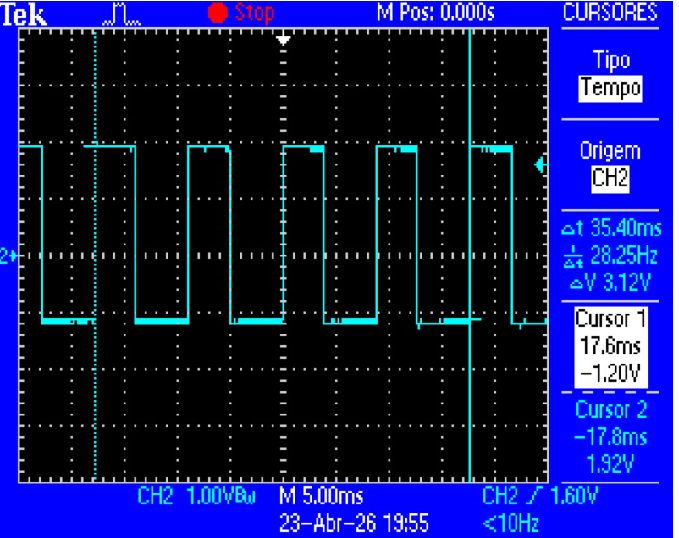
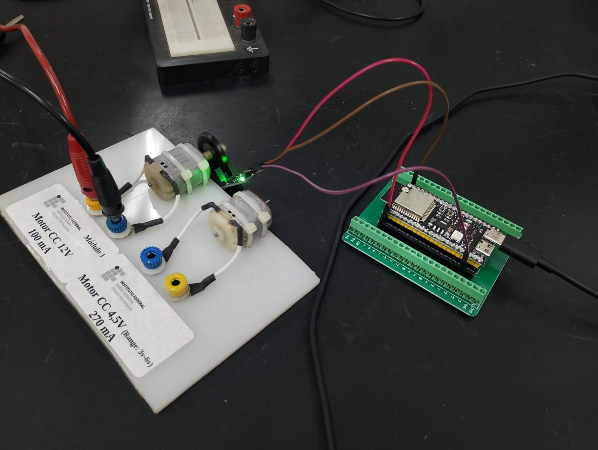
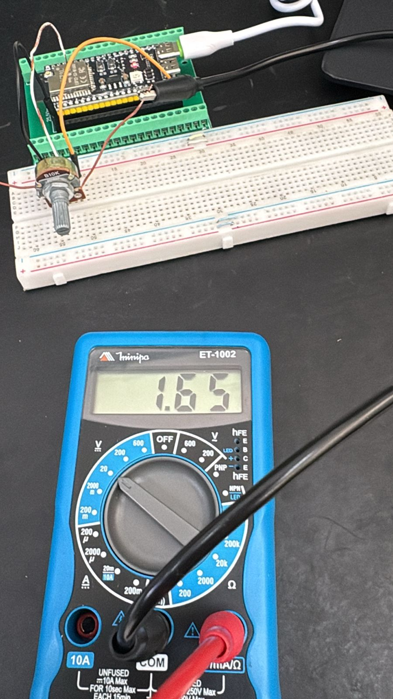
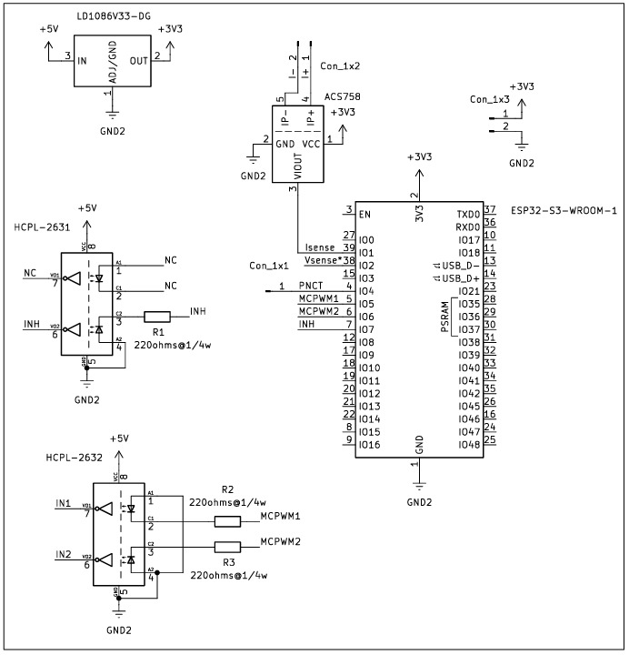

Etapa 2
#######

.. contents::
   :local:
   :depth: 2

Visão geral
***********

Na Etapa 2, foram realizados testes individuais com os sensores que serão utilizados com o microcontrolador, e o desenvolvimento dos esquemáticos dos hardwares do sistema. As atividades desenvolvidas nesta etapa são:

📌 Teste do encoder óptico no microcontrolador

📌 Teste do sensor de corrente no microcontrolador

📌 Esquemátco da placa de potência

📌 Esquemátco da placa de controle

Desenvolvimento
***************

Apresentar o desenvolvimento da etapa contendo detalhes de implementação (se houver) de hardware e software. Adicionar pesqusisas realizadas bem como testes realizados.

Teste do encoder óptico no microcontrolador.
======

wheel.h

.. code-block:: vhdl

   #ifndef MAIN_WHEEL_H_
   #define MAIN_WHEEL_H_
   
   #include "driver/pulse_cnt.h"
   
   // Pino do encoder (D0)
   #define ENCODER_GPIO  14
   
   void wheel_Init(void);
   void wheel_GetEncoderPulses(int *pulsos);
   
   #endif   

wheel.c

.. code-block:: vhdl

   #include "wheel.h"
   #include "esp_log.h"
   #include "esp_err.h"
   
   static const char *TAG = "WHEEL";
   
   static pcnt_unit_handle_t pcnt_unit = NULL;
   
   void wheel_Init(void)
   {
       ESP_LOGI(TAG, "Inicializando PCNT...");
   
       pcnt_unit_config_t unit_config = {
           .low_limit  = -32768,   // ✔️ obrigatório no IDF v6
           .high_limit = 32767,
           .flags = {
               .accum_count = true, // ✔️ obrigatório
           },
       };
   
       ESP_ERROR_CHECK(pcnt_new_unit(&unit_config, &pcnt_unit));
   
       pcnt_channel_handle_t chan = NULL;
   
       pcnt_chan_config_t chan_config = {
           .edge_gpio_num = ENCODER_GPIO,
           .level_gpio_num = -1, // ✔️ encoder simples (D0)
       };
   
       ESP_ERROR_CHECK(pcnt_new_channel(pcnt_unit, &chan_config, &chan));
   
       // Conta na borda de subida
       ESP_ERROR_CHECK(pcnt_channel_set_edge_action(chan,
           PCNT_CHANNEL_EDGE_ACTION_INCREASE,
           PCNT_CHANNEL_EDGE_ACTION_HOLD));
   
       // Mantém comportamento estável
       ESP_ERROR_CHECK(pcnt_channel_set_level_action(chan,
           PCNT_CHANNEL_LEVEL_ACTION_KEEP,
           PCNT_CHANNEL_LEVEL_ACTION_KEEP));
   
       // Filtro de ruído
       pcnt_glitch_filter_config_t filter_config = {
           .max_glitch_ns = 2000,
       };
   
       ESP_ERROR_CHECK(pcnt_unit_set_glitch_filter(pcnt_unit, &filter_config));
   
       ESP_ERROR_CHECK(pcnt_unit_enable(pcnt_unit));
       ESP_ERROR_CHECK(pcnt_unit_clear_count(pcnt_unit));
       ESP_ERROR_CHECK(pcnt_unit_start(pcnt_unit));
   
       ESP_LOGI(TAG, "Encoder inicializado (D0)");
   }
   
   void wheel_GetEncoderPulses(int *pulsos)
   {
       if (pcnt_unit == NULL) {
           ESP_LOGE(TAG, "pcnt_unit NULL!");
           *pulsos = 0;
           return;
       }
   
       esp_err_t err = pcnt_unit_get_count(pcnt_unit, pulsos);
   
       if (err != ESP_OK) {
           ESP_LOGE(TAG, "Erro ao ler PCNT: %s", esp_err_to_name(err));
           *pulsos = 0;
       }
   }

Main.c

.. code-block:: vhdl

   #include <stdio.h>
   #include <stdio.h>
   #include "freertos/FreeRTOS.h"
   #include "freertos/task.h"
   #include "esp_log.h"
   #include "wheel.h"
   
   static const char *TAG = "MAIN";
   
   // Encoder com 20 ranhuras
   #define PULSOS_POR_VOLTA 20
   
   void app_main(void)
   {
       ESP_LOGI(TAG, "Iniciando sistema...");
   
       wheel_Init();
   
       int last_pulsos = 0;
   
       while (1)
       {
           int pulsos;
   
           wheel_GetEncoderPulses(&pulsos);
   
           int delta = pulsos - last_pulsos;
           last_pulsos = pulsos;
   
           float dt = 0.05; // 100 ms
   
           float rpm = (delta / (float)PULSOS_POR_VOLTA) * (60.0 / dt);
   
           ESP_LOGI(TAG, "RPM: %.2f", rpm);
   
           vTaskDelay(pdMS_TO_TICKS(50));
       }
   }

Teste do sensor de corrente no microcontrolador.
======

Para a medição de corrente, foi inicialmente considerado o uso do sensor ACS712, que opera com alimentação de 5 V. No entanto, como o microcontrolador utilizado possui entradas limitadas a 3,3 V, pode causar danos ao microcontrolador. Embora seja possível utilizar um divisor resistivo para adequar os níveis de tensão, optou-se por testar o ADC, já que o driver que será utilizado também é capaz de fazer a leitura de corrente.

Foi considerado o sensor será o ACS758, adequado para sistemas de 3,3 V. Enquanto sensor não está disponível, o teste de leitura do ADC foi feito utilizando um potenciômetro. 

Para validar, foi feita a comparação entre os valores medidos pelo ADC e as tensões medidas no multímetro.  Para uma leitura correta  foi considerada a característica desses sensores, onde a saída apresenta um offset aproximadamente igual à metade da tensão de alimentação (Vcc/2). Para 3,3 V, esse valor é teoricamente próximo de 1,65 V.

No software foi implementado um procedimento de calibração automática do offset, realizado no instante da inicialização do sistema, na ausência de corrente. Esse processo permite determinar o valor real do offset experimentalmente, já que pode ter pequenas variações

Main.c
   
.. code-block:: vhdl  

   #include <stdio.h>
   #include "freertos/FreeRTOS.h"
   #include "freertos/task.h"
   #include "esp_adc/adc_oneshot.h"
   #include "esp_adc/adc_cali.h"
   #include "esp_adc/adc_cali_scheme.h"
   
   // CONFIGURAÇÕES 
   #define ADC_CHANNEL        ADC_CHANNEL_0   // GPIO1 (ajuste se necessário)
   #define ADC_UNIT           ADC_UNIT_1
   #define ADC_ATTEN          ADC_ATTEN_DB_11 // até ~3.3V
   #define ADC_BITWIDTH       ADC_BITWIDTH_DEFAULT
   
   #define NUM_SAMPLES        200             // média
   #define SENSITIVITY        0.04f           // 40 mV/A (ACS758 típico)
   #define VCC                3.3f
   
   // VARIÁVEIS GLOBAIS
   adc_oneshot_unit_handle_t adc_handle;
   adc_cali_handle_t adc_cali_handle = NULL;
   
   float offset_voltage = 1.65; // 1.65 valor tipico -> vcc/2
   
   
   // FUNÇÃO PARA LER TENSÃO 
   float read_voltage()
   {
       int adc_raw = 0;
       int voltage = 0;
   
       int soma = 0;
   
   	//for, pra ler ADC melhor, tirando medias
       for (int i = 0; i < NUM_SAMPLES; i++) {
           adc_oneshot_read(adc_handle, ADC_CHANNEL, &adc_raw);
           soma += adc_raw;
       }
   
       adc_raw = soma / NUM_SAMPLES;
   
       adc_cali_raw_to_voltage(adc_cali_handle, adc_raw, &voltage);
   
       return voltage / 1000.0; // mV -> V
   }
   
   // CALIBRAÇÃO DE OFFSET 
   void calibrate_offset()
   {
       printf("Calibrando offset... NÃO passe corrente!\n");
   
       vTaskDelay(pdMS_TO_TICKS(2000));
   
       float soma = 0;
   
       for (int i = 0; i < 100; i++) {
           soma += read_voltage();
           vTaskDelay(pdMS_TO_TICKS(10));
       }
   
       offset_voltage = soma / 100.0;
   
       printf("Offset calibrado: %.3f V\n\n", offset_voltage);
   }
   
   // APP MAIN 
   void app_main(void)
   {
       // Inicializa ADC
       adc_oneshot_unit_init_cfg_t init_config = {
           .unit_id = ADC_UNIT,
       };
       adc_oneshot_new_unit(&init_config, &adc_handle);
   
       adc_oneshot_chan_cfg_t config = {
           .bitwidth = ADC_BITWIDTH,
           .atten = ADC_ATTEN_DB_12,
       };
       adc_oneshot_config_channel(adc_handle, ADC_CHANNEL, &config);
   
       // Calibração do ADC
       adc_cali_curve_fitting_config_t cali_config = {
           .unit_id = ADC_UNIT,
           .atten = ADC_ATTEN_DB_12,
           .bitwidth = ADC_BITWIDTH,
       };
       adc_cali_create_scheme_curve_fitting(&cali_config, &adc_cali_handle);
   
       // Calibra offset
       calibrate_offset();
   
       while (1) {
   
           float voltage = read_voltage();
   
           // Corrente = (Vout - offset) / sensibilidade
           float current = (voltage - offset_voltage) / SENSITIVITY;
   
           printf("Tensao: %.3f V | Corrente: %.2f A\n", voltage, current);
   
           vTaskDelay(pdMS_TO_TICKS(500));
       }
   }

Os valores de tensão e corrente obtidos pelo ADC ficaram bem próximos do mostrados no multímetro e calculados de forma teórica para a corrente aumentando linearmente conforme o esperado. Sendo possível ajustar a sensibilidade de 40mV/A para que os valores se aproximem ainda mais.

+---------------+------------------+--------------+------------------+-------------+
| Multímetro (V)| ADC (V)          | Corrente exp | Corrente medida  | Erro        |
+===============+==================+==============+==================+=============+
| 1.00          | 1.00             | -15.15 A     | -16.40 A         | ~8%         |
+---------------+------------------+--------------+------------------+-------------+
| 1.65          | 1.65             | ~0 A         | 0 A              | OK          |
+---------------+------------------+--------------+------------------+-------------+
| 2.00          | 2.00             | 7.58 A       | 8.70 A           | ~15%        |
+---------------+------------------+--------------+------------------+-------------+
| 2.50          | 2.51             | 18.94 A      | 21.43 A          | ~13%        |
+---------------+------------------+--------------+------------------+-------------+
| 3.00          | 3.03             | 30.30 A      | 34.48 A          | ~14%        |
+---------------+------------------+--------------+------------------+-------------+
| 2.50          | 2.51             | 18.94 A      | 21.43 A          | ~13%        |
+---------------+------------------+--------------+------------------+-------------+

Esquemátco da placa de potência.
======

Esquemátco da placa de controle.
======

(Outras subseções se necessário)
================================

Referências
*************************************

- `nRF Connect SDK <https://developer.nordicsemi.com/nRF_Connect_SDK/doc/2.4.2/nrf/getting_started/modifying.html#configure-application>`_

