Etapa 3
#######

.. contents::
   :local:
   :depth: 2

Visão geral
***********

Na Etapa 3, foram realizados 

📌 Projeto do controlador PID

📌 Implementação preliminar do controle PID no microcontrolador.

📌 Apresentação do gabinete desenvolvido em software 3D

📌 Layout da placa de potência

📌 Layout da placa de controle

📌 Teste de acionamento do motor

📌 Firmware preliminar com teste de comunicação COAP

Desenvolvimento
***************

Apresentar o desenvolvimento da etapa contendo detalhes de implementação (se houver) de hardware e software. Adicionar pesqusisas realizadas bem como testes realizados.

Projeto do controlador PID
======

Implementação preliminar do controle PID no microcontrolador.
======

Apresentação do gabinete desenvolvido em software 3D
======

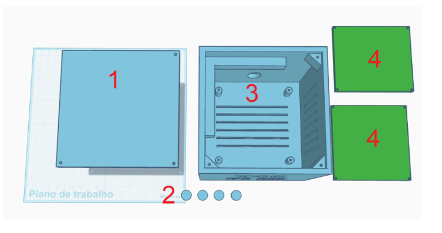
*Figura  – Projeto do gabinete e acessórios 3D no software Tinkercad*

*Fonte: autoria própria*

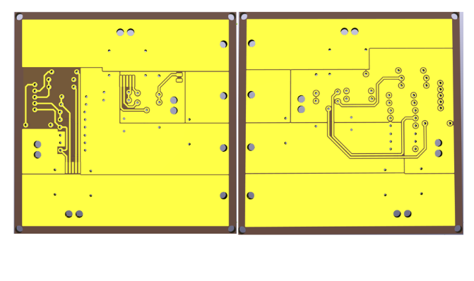
*Figura  – Pré-visualização do trabalho no software Ulti Maker*

*Fonte: autoria própria*

Layout da placa de potência
======

O layout da placa de circuito impresso (PCI) foi desenvolvido no Kicad 10, com os componentes importados diretamente do esquemático criado na Etapa II. O posicionamento dos componentes, as trilhas de conexão e as áreas de plano foram baseados na placa de teste (demoboard) recomendada na documentação da fabricante Infineon para o driver meia-ponte BTN8982TA. O layout de referência e a respectiva placa física finalizada são apresentados conforme a Figura 1 da esquerda para direita como: top layer, bottom layer e demoboard.

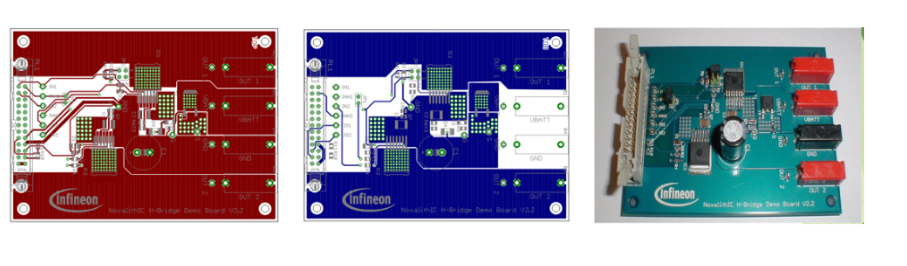
*Figura  – Layout da placa de demonstração para o BTN8982TA*

*Fonte: Adaptado de Infineon Technologies AG (2011)*

Observa-se uma largura significativa nas trilhas de potência, projetadas para suportar correntes contínuas de até 55A. Essa largura é de 20mm por camada com espessura de cobre de 4oz/ft² total, totalizando uma seção transversal equivalente a 40mm de largura combinada. No protótipo desenvolvido (Figura 2), manteve-se a largura combinada de 40mm, porém com espessura restrita a 2oz/ft² somando ambas as faces, devido às limitações de matéria-prima disponíveis no IFSC. 

A validação dimensional foi realizada por meio de cálculos baseados na norma IPC-2221. Embora a largura nominal atenda aos critérios na maior parte da extensão, o layout inevitavelmente apresenta estreitamentos geométricos e reduções na área de condução próximos aos terminais do componente. Para mitigar o surgimento de pontos quentes (hotspots) nesses gargalos e proteger o substrato de fenolite, cuja temperatura de transição vítrea e a resistência térmica são substancialmente inferiores às do padrão FR-4 recomendado —, previu-se a remoção da máscara de solda ao longo das trilhas de potência para a aplicação de uma camada de estanho adicional. Essa técnica reduz a resistência ôhmica equivalente e melhora a dissipação térmica do circuito. 

Por fim, ressalta-se que foram realizadas alterações pontuais em relação ao projeto original da demoboard, tais como a remoção de conectores auxiliares redundantes e a substituição de componentes SMD por equivalentes PTH (Through-Hole). Essa decisão de projeto justificou-se pela necessidade de otimizar o processo de confecção manual local do protótipo e facilitar futuras manutenções corretivas em laboratório, sem comprometer a integridade e o funcionamento do circuito. A placa desenvolvida pode ser vista conforme a Figura 2, da esquerda para a direita como: top layer e bottom layer.

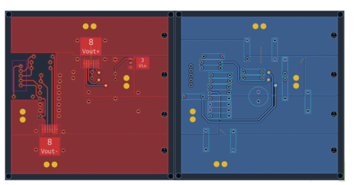
*Figura - Layout da placa desenvolvida*

*Fonte: Autoria própria*

O circuito foi projetado para operar com uma corrente contínua de 35A sob tensão nominal de 24V, totalizando uma capacidade de potência de até 840W. De acordo com os critérios de isolamento para a faixa de 0V a 30V CC, o distanciamento mínimo (clearance) entre as trilhas deve ser de aproximadamente 0,13mm, validando a segurança operacional do protótipo nesta faixa de tensão. A confecção da placa seguiu estritamente os parâmetros técnicos recomendados pelo manual de desenvolvimento para fresa mecânica do IFSC, cujas especificações de fabricação estão detalhadas na Tabela 1. Para o dimensionamento térmico das trilhas de potência, os cálculos baseados na norma IPC-2221 resultaram em uma largura recomendada de 677 mil (aproximadamente 17,2mm, arredondados para 20mm no layout), considerando uma elevação de temperatura limite de 40°C em relação ao ambiente. A interface da ferramenta utilizada para essa validação é apresentada na Figura 3.

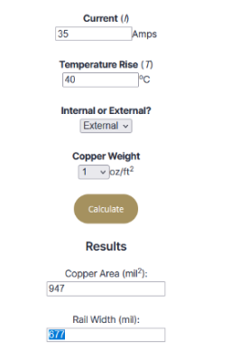
*Figura 3 – Ferramenta de cálculo de largura de trilha IPC-2221*

*Fonte: Altium (2025)*

Configurações da placa desenvolvida:

+-----------------------------------+------------------+
| Parâmetro                         | Valor            |
+===================================+==================+
| Isolamento entre trilhas          | 8 mil            |
+-----------------------------------+------------------+
| Isolamento entre borda e cobre    | 12 mil           |
+-----------------------------------+------------------+
| Isolamento de furo a furo         | 16 mil           |
+-----------------------------------+------------------+
| Largura mínima de trilha          | 20 mil           |
+-----------------------------------+------------------+
| Diâmetro mínimo de furo           | 40 mil           |
+-----------------------------------+------------------+
| Diâmetro mínimo de cobre          | 80 mil           |
+-----------------------------------+------------------+
| Camada de cobre                   | 1 oz/ft²         |
+-----------------------------------+------------------+
*Tabela 1 – Configurações da placa desenvolvida*

*Fonte: Autoria própria*

Para a fabricação por fresa mecânica, é indispensável a geração dos arquivos em formato Gerber, os quais mapeiam com precisão as coordenadas de furação, o dimensionamento das trilhas e as distâncias de isolamento. Estes arquivos foram exportados e serão encaminhados ao técnico responsável pelo setor de fresa durante a Etapa IV para a execução da usinagem. Uma pré-visualização tridimensional do circuito, simulada no ambiente Kicad, é apresentada da esquerda para direita na Figura 4, como: top layer e bottom layer. Após a entrega da placa física, os componentes listados na Tabela 2 serão soldados para que o protótipo seja submetido aos testes de validação, procedimentos que também integrarão o escopo da Etapa IV.

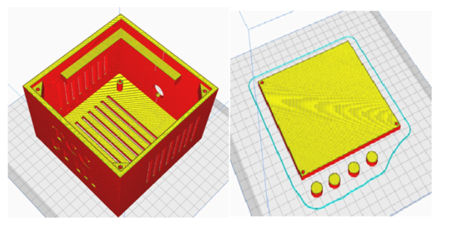
*Figura - Visualização 3D e esquema de furação*

*Fonte: autoria própria*

Lista de componentes:

+----------------+----------------------+-------------------------------------------+
| Tipo           | Quantidade           | Valor                                     |
+================+======================+===========================================+
| Resistores     | 2x, 2x, 5x           | 1 kΩ, 5,1 kΩ@1%, 10 kΩ                    |
+----------------+----------------------+-------------------------------------------+
| Capacitores    | 2x, 5x, 4x, 1x       | 1nF, 100nF, 220nF, 1000uF (low ESR)       |
+----------------+----------------------+-------------------------------------------+
| Semicondutores | 2x, 1x, 1x           | BTN8982TA, IPD90P03P4L04, Diodo 10V@1W    |
+----------------+----------------------+-------------------------------------------+
| Conectores     | 4x, 1x               | Furo AWG8, Molex 5 pinos                  |
+----------------+----------------------+-------------------------------------------+
| Total          | 25                   |                                           |
+----------------+----------------------+-------------------------------------------+
*Tabela 2 – Lista de componentes*

*Fonte: autoria própria*

Layout da placa de controle
======

Inicialmente, cogitou-se o desenvolvimento de uma segunda placa de circuito impresso dedicada exclusivamente aos circuitos de controle, de modo a isolá-los fisicamente da etapa de potência. Contudo, devido à relativa simplicidade do circuito de controle e mediante o aval do corpo docente, optou-se pela utilização de uma placa adaptadora comercial para o ESP32 dotada de terminais de saída. A integração dessa solução justificou-se pelo fato de o módulo comercial possuir padrão de fabricação industrial, o que confere elevada robustez e confiabilidade elétrica ao sistema. Desse modo, evitou-se a replicação manual de um circuito integrado cujas especificações de qualidade em laboratório não igualariam o padrão industrial disponível. 
O diagrama completo das interconexões do sistema é apresentado na Figura 5, ilustrando, da esquerda para a direita, a placa adaptadora e o respectivo diagrama esquemático.

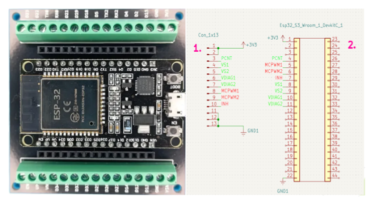
*Figura 5 – Esquema de conexões da placa de controle*

*Fonte: autoria própria*

Teste de acionamento do motor
======

Para testar o acionamento do motor da esteira, foi desenvolvido um firmware responsável pela geração do sinal PWM, controle do driver e aquisição da velocidade utilizando o encoder acoplado ao eixo do motor.

Para a parte de leitura e aquisição da velocidade em RPM, foi utilizado como base o código desenvolvido anteriormente para o encoder, reutilizando o módulo “wheel”. Porém, a forma de aquisição dos dados foi alterada para melhorar a medição em baixas velocidades, já que para valores baixos de RPM a quantidade de pulsos gerados pelo encoder em pequenos intervalos de tempo é reduzida, tornando a leitura sensível, mostrando valores falsos.

Para fins de teste e validação do acionamento, foi utilizado o driver L293N. Apesar de não ser o driver mais adequado para o motor da esteira (BDC - Brushed DC Motor), ele permitiu validar o funcionamento do acionamento inicial do sistema. O L293N possui limitação de tensão máxima em torno de 12V e apresenta uma queda de tensão significativa internamente, normalmente entre 2V e 4V. O motor da esteira, por outro lado, é capaz de operar com até 24V, valor no qual atingiria sua velocidade máxima nominal.

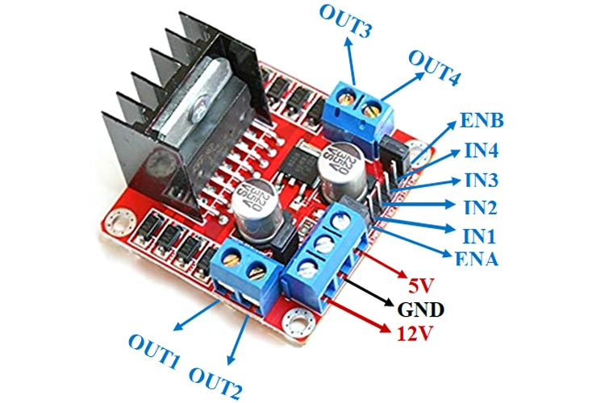
*Figura  – Módulo driver L298N*  

*Fonte: Components101*

No firmware foi desenvolvido o módulo “Motor”, que utiliza o periférico LEDC para geração do PWM. Foi configurado com frequência de 1 kHz e resolução de 10 bits, permitindo um duty cycle na faixa de 0 a 1023. 

Conexões:

GPIO14  → D0 encoder

GPIO18  → ENB LF293N (PWM)

GPIO2    → IN3 LF293N (Sentido)

GPIO21  → IN4 LF293N (Sentido)

O timer do PWM foi criado com a estrutura ledc_timer_config_t, ele foi configurado com uma frequência de 1kHz e uma resolução de 10bits, o que dá uma faixa para o PWM de 0 a 1023.
Para validar foram realizadas medições com o osciloscópio tanto na saída PWM do microcontrolador quanto na saída do driver conectada ao motor. 

A Figura  mostra o sinal PWM medido na saída do microcontrolador. Possui um sinal PWM com frequência aproximada de 1 kHz e amplitude próxima de 3,3V, que corresponde com o esperado.

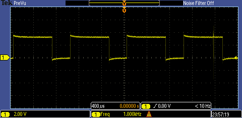
*Figura - Sinal PWM gerado microcontrolador*

*Fonte : Autoria própria*

O sinal medido na saída do driver conectado ao motor da esteira é mostrado na figura abaixo. Ele reproduz o PWM aplicado, com uma amplitude maior, algumas deformações e quedas de tensão características do L293N.

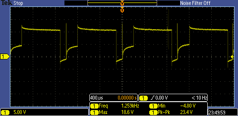
*Figura - Sinal na saída do driver*

*Fonte : Autoria própria*

A função motor_SetDuty(), foi feita para alterar o valor do duty cycle, fazendo com que a tensão média aplicada no motor varie, e como consequência a velocidade.
Foram feitos diversos testes alterando o PWM e o sentido da esteira, e visivelmente a velocidade se alterava, no terminal, imprimia a velocidade atual com uma certa variação, não sendo possível dectectar uma velocidade especifica e sim uma faixa.

Comparação entre RPM teórico e medições práticas

+------+--------+--------------+----------------------+------------------------+
| PWM  | Duty   | RPM Teórico  | RPM Médio (Prático)  | Faixa (Min – Max)      |
+======+========+==============+======================+========================+
| 350  | 0.34   | ~0           | 0                    | Não acionou            |
+------+--------+--------------+----------------------+------------------------+
| 550  | 0.54   | ~7.8         | ~9.5                 | 6.48 – 12.54           |
+------+--------+--------------+----------------------+------------------------+
| 750  | 0.73   | ~15.0        | ~14.8                | 10.50 – 18.97          |
+------+--------+--------------+----------------------+------------------------+
| 950  | 0.93   | ~22.2        | ~19.8                | 17.34 – 21.82          |
+------+--------+--------------+----------------------+------------------------+
| 1023 | 1.00   | ~25.0        | ~23.5                | 21.36 – 26.02          |
+------+--------+--------------+----------------------+------------------------+
*Tabela 3 - Comparação de valores*

*Fonte : Autoria própria*

Os valores da tabela mostram que o resultado está compatível com o esperado e o driver está sendo capaz de acionar o motor da esteira, a partir de um sinal PWM definido.

Firmware preliminar com teste de comunicação COAP
======

.. code-block:: c

    #include <stdio.h>
    #include <string.h>

    #include "freertos/FreeRTOS.h"
    #include "freertos/task.h"

    #include "esp_wifi.h"     //controla wifi
    #include "esp_event.h"    //sitema de eventos do esp
    #include "esp_log.h"

    #include "lwip/sockets.h" // sockets UDP/TCP
    #include "lwip/netdb.h"
    #include "lwip/inet.h"    // IP e portas

    #include "nvs_flash.h"    //Memória flash usada pelo Wi-Fi
    #include "esp_netif.h"    //Camada de interface de rede

    #include "coap3/coap_forward_decls.h"
    #include "coap3/coap.h" //biblioteca COAP

    #define WIFI_SSID "lpae_wifi"
    #define WIFI_PASS "esp-8266"

    static bool coap_task_started = false;  //flag para ver se a tarefa nao fica se repetindo,criando varias vezes
    static const char *TAG = "WIFI";
    static int velocidade_atual = 0;        //variavel que é o estado atual da esteira

    //função que será chamada AUTOMATICAMENTE quando chegar: POST /vel
    //deixa o esp como servidor COAP, capaz de receber comando externo
    void hnd_post_vel(
        coap_resource_t *resource, //recurso coap acessado (/vel)
        coap_session_t *session,   //sessao COAP de quem enviou a mensagem
        const coap_pdu_t *request, //Pacote que chega no esp
        const coap_string_t *query,
        coap_pdu_t *response)      //Pacote de resposta que o esp vai devolver
    {
        size_t size;     //numero de bytes que chega
        uint8_t *data;   //ponteiro para os bytes que chegam

    //extrai payload recebido.
        if(coap_get_data(request, &size, &data))
        {
            ESP_LOGI(TAG, "Payload recebido no POST");

         //   printf("%.*s\n", (int)size, data);   //imprimi payload
         char buffer[20];   //cria string temporaria

        memcpy(buffer, data, size); //copia os bytes recebidos
        buffer[size] = '\0';        //transforma os bytes em string valida terminada em \0, para usar o atoi

        velocidade_atual = atoi(buffer); //atoi converte para inteiro

        ESP_LOGI(TAG, "Velocidade recebida: %d", velocidade_atual);
        }

        //define o status da resposta CoAP
        coap_pdu_set_code(response, COAP_RESPONSE_CODE_CHANGED); //envia resposta 2.04 Changed/resposta do servidor e que foi alterado alguma coisa
        const char *resp_str = "OK"; //esp respondendo ao servidor que payload foi recebido

        //coloca dentro do pacote de resposta
        coap_add_data(
            response,
            strlen(resp_str),
            (const uint8_t *)resp_str);
    }

    void hnd_get_vel(                 //cria handler GET, notebook pode pegar velocidade atual
        coap_resource_t *resource,    //recurso logico /vel
        coap_session_t *session,
        const coap_pdu_t *request,
        const coap_string_t *query,
        coap_pdu_t *response)
    {
        char resp[50];

    //monta a string "dinamica"
        sprintf(resp,
                "Velocidade atual: 8");

    //define o status da resposta CoAP
        coap_pdu_set_code(
            response,
            COAP_RESPONSE_CODE_CONTENT);

    //coloca dentro do pacote de resposta
        coap_add_data(
            response,
            strlen(resp),
            (const uint8_t *)resp);

        ESP_LOGI(TAG, "GET /vel respondido");
    }

    void coap_client_task(void *pvParameters)
    {
        ESP_LOGI(TAG, "CoAP task iniciou");

        coap_startup(); //inicializa biblioteca coap (libcoap)

        ESP_LOGI(TAG, "Biblioteca CoAP inicializada");

    //estrutura necessaria para contexto COAP(gerenciador de sessões,controle de sockets CoAP)
        coap_context_t *ctx = coap_new_context(NULL); //ctx eh "Sistema operacional do COAP"
        if(ctx == NULL)  //checa se criou contexto
        {
            ESP_LOGE(TAG, "Erro ao criar contexto CoAP");
            vTaskDelete(NULL);
            return;
        }
        ESP_LOGI(TAG, "Contexto CoAP criado");

    //Criacao do servidor
        coap_address_t serv_addr;  //cria estrutura do endereço do servidor.
        coap_address_init(&serv_addr);   //zera/inicializa estrutura.
        serv_addr.addr.sin.sin_family = AF_INET;  //usa IPv4.
        serv_addr.addr.sin.sin_addr.s_addr = INADDR_ANY;  // INADDR_ANY significa escutar qualquer IP do ESP
        serv_addr.addr.sin.sin_port = htons(5683); //abre porta padrão CoAP(5683):

        coap_endpoint_t *endpoint;  //cria o endpoint servidor CoAP/abre o socket servidor.
        endpoint = coap_new_endpoint(  //abre o “socket CoAP servidor”.
            ctx,               //contexto CoAP criado antes.
            &serv_addr,   //serv_addr é a estrutura do endereço do servidor
            COAP_PROTO_UDP);       // CoAP usa UDP.

            if(endpoint == NULL)  //testa se endpoint foi criado
        {
            ESP_LOGE(TAG, "Erro ao criar endpoint CoAP");
            vTaskDelete(NULL);
            return;
        }
        ESP_LOGI(TAG, "Endpoint servidor CoAP criado");

        //Cria recurso = "endpoint logico"
        coap_resource_t *resource;
        resource = coap_resource_init(
            coap_make_str_const("vel"), //cria endpoint vel
            0);

        coap_register_handler(  //Liga POST ao handler
    //quando chegar POST /vel  chama hnd_post_vel())
            resource,
            COAP_REQUEST_POST,
            hnd_post_vel);

        coap_register_handler(  //Liga GET ao handler
            resource,
            COAP_REQUEST_GET,
            hnd_get_vel);

        //adiciona recurso ao servidor, servidor COAP conhece "/vel "
        coap_add_resource(ctx, resource);  //Adiciona ao servidor(endpoint conhece /vel)
        ESP_LOGI(TAG, "Recurso /vel criado");

        while (1)
        {
           coap_io_process(ctx, COAP_IO_WAIT); //coap_io_process é o que faz tudo rodar
           vTaskDelay(pdMS_TO_TICKS(100));
        }
    }

    static void wifi_event_handler(             //reage a eventos do Wi-Fi.
        void *arg,
        esp_event_base_t event_base,            //qual “categoria” do evento aconteceu,IP ou WIFI.
        int32_t event_id,                       //qual evento específico aconteceu
        void *event_data)                       //dados extras do evento(IO,mascara,gateway)

    {
        // verifica se Wi-Fi iniciou com WIFI_EVENT_STA_START
        if(event_base == WIFI_EVENT &&
           event_id == WIFI_EVENT_STA_START) //quando esp liga, gera o envento WIFI_EVENT_STA_START
        {
            esp_wifi_connect();     //manda o ESP conectar no roteador.
        }

        // Conectou e recebeu IP com IP_EVENT_STA_GOT_IP
        if(event_base == IP_EVENT &&
           event_id == IP_EVENT_STA_GOT_IP)
        {
            ip_event_got_ip_t *event =
                (ip_event_got_ip_t *) event_data;        //pega IP recebido

            ESP_LOGI(TAG,
                     "IP: " IPSTR,
                     IP2STR(&event->ip_info.ip));

            if(!coap_task_started)           //garante que tarefa COAP nao seja criada varias vezes, caso a internet caia,troca IP,etc
            {
                coap_task_started = true;

                xTaskCreate(                     // cria tarefa do coap_client_task
                    coap_client_task,
                    "coap_client",
                    8192,
                    NULL,
                    5,
                    NULL);
            }
        }

        // Desconectou
        if(event_base == WIFI_EVENT &&
           event_id == WIFI_EVENT_STA_DISCONNECTED)
        {
            ESP_LOGI(TAG, "Reconectando...");
            esp_wifi_connect();
        }
    }

    void wifi_init_sta(void)    //função que monta toda infraestrutura de rede.
    {
        // Inicializa pilha de rede
        esp_netif_init();

        // Event loop, cria sistema de enventos
        esp_event_loop_create_default();

        // Cria a interface Wi-Fi no modo station
        esp_netif_create_default_wifi_sta();

        //Cria estrutura de configuração padrão do driver Wi-Fi
        wifi_init_config_t cfg =
            WIFI_INIT_CONFIG_DEFAULT();

        esp_wifi_init(&cfg);   //Inicializa driver Wi-Fi do esp

        // Registra eventos de wi-fi, qunado acontece alguma evento WIFI, chama função do evento
        esp_event_handler_instance_register(
            WIFI_EVENT,
            ESP_EVENT_ANY_ID,
            &wifi_event_handler,
            NULL,
            NULL);

        // Registra eventos de IP
        esp_event_handler_instance_register(
            IP_EVENT,
            IP_EVENT_STA_GOT_IP,
            &wifi_event_handler,
            NULL,
            NULL);

        // config do wifi
        wifi_config_t wifi_config = {
            .sta = {
                .ssid = WIFI_SSID,
                .password = WIFI_PASS
            },
        };

        esp_wifi_set_mode(WIFI_MODE_STA);  //Modo estação

        esp_wifi_set_config(                   //Aplica config
            WIFI_IF_STA,
            &wifi_config);

        esp_wifi_start();         //inicia wifi
    }

    void app_main(void)
    {
        // Inicializa NVS
        nvs_flash_init();      //Inicializa NVS(memória flash usada pelo Wi-Fi

        // Inicializa Wi-Fi
        wifi_init_sta();
    }

	   

Nesta etapa do projeto foi desenvolvido um sistema de comunicação utilizando o protocolo CoAP com objetivo de fazer com que o microcontrolador envie e receba mensagens do servidor, que posteriormente será adptado, para conseguir acompanhar a velocidade atual da esteira e setar uma nova velocidade desejada. 

Inicialmente foi feita a configuração da conexão wi-fi em modo Station (WIFI_MODE_STA). Foram utilizados os módulos: esp_wifi, esp_event e esp_netif. A conexão foi feita usando os eventos do sistema, fazendo com que o esp: inicializasse automaticamente o wifi, conectasse ao roteador, pega o endereço IP, e caso perca o sinal, seja capaz de se reconectar.

Com o esp conectado, apereceu no terminal o IP obtido, comprovando a conexão.

Antes de implementar o COAP em si, foi feito um teste usando comunicação UDP pura, onde foi criado uma tarefa,  responsável pela criação do socket UDP, e envio de uma mensagem para um notebook conectado na mesma rede, com o objetivo de compreender melhor o protocolo, e validar a comunicação wifi e o envio de dados usando sockets UDP. A mensagem foi enviada usando a função "sendto()"

Com essa comunicação validada, foi adicionada a bbilbioteca "libcoap", que é a responsável pela implementação do protocolo. A implementação foi feita através do arquivo "idf_component.yml" e adicionada na pasta do projeto. 

Com a biblioteca adicionada, foi feito a criação da tarefa principal "coap_client_task()", responsável por inicializar a biblioteca CoAP utilizando coap_startup() e criar o contexto principal do protocolo pela da função coap_new_context(NULL). Esse contexto é o núcelo da comunicação COAP, responsável pelo gerenciamento de sessões, sockets e processar as mensagens.

Em seguida foi implementado um servidor CoAP local dentro do ESP32-S3. Para isso foi criada uma estrutura de endereço utilizando coap_address_t, configurada para utilizar IPv4 (AF_INET), protocolo UDP e a porta padrão do CoAP (5683). O servidor foi então criado utilizando a função coap_new_endpoint(), permitindo que outros dispositivos da rede enviassem requisições diretamente para o ESP.

Com o servidor criado, foi implementado o recurso "/vel", que vai representar uma URI responsável pelo controle e monitoramento da velocidade da esteira. Foi criado com coap_resource_init() e adicionado ao contexto COAP, pela função coap_add_resource().

Para tratar as requisições foi implementado dois handlers: hnd_post_vel() e hnd_get_vel().

A função post, é exectuada quando o esp receber uma mensagem no recusro /vel, ela vai extrair o payload enviado pelo cliente, extrair os dados com coap_get_data() , converter os bytes em string e transformar em inteiro. Após receber e processar o valor, o esp envia uma resposta ao client com "OK", indicando o recebimento da mensagem.  

Para hnd_get_value, foi implementada para que quando o notebook realiza um GET no recurso /vel, o ESP monta uma string contendo o estado atual da variável velocidade e envia essa informação de volta ao cliente CoAP

Para manter o funcionamento continuo foi feito um laço com a função coap_io_process(ctx, COAP_IO_WAIT), essa função é responsável por processar continuamente os eventos da pilha CoAP, como recebimento de requisições, envio de respostas e gerenciamento do protocolo.

Para validar o funcionamento, foi criado um cliente CoAP em Python utilizando a biblioteca aiocoap. O programa em Python atua como cliente da aplicação, permitindo enviar requisições POST para alterar a velocidade da esteira e requisições GET para consultar o valor atual armazenado no ESP32-S3.

.. code-block:: python

   from aiocoap import *    #implementa o protocolo CoAP em Python
   import asyncio		 #sistema assíncrono do Python

   async def main():        #cria funcao assincrona, para usar o await

   protocol = await Context.create_client_context()    #cria o cliente CoAP

   while True:

   #Post
        vel = input("Digite a velocidade: ")

        request = Message(      #cria uma requisição Post
            code=POST,		#defini o tipo(post)
            payload=vel.encode(),  #converte string em bytes
            uri="coap://192.168.1.119/vel"   #destino
        )
	
	#Envia requisição e espera resposta do esp com ok
        response = await protocol.request(request).response

        print("Resposta do ESP que recebeu:")
        print(response.payload.decode())  #converte dnv bytes em string

   #GET
        request_get = Message(     #cria uma requisição GET
            code=GET,
            uri="coap://192.168.1.119/vel"
        )

        response_get = await protocol.request(request_get).response

	            
        print("Resposta GET:")
        print(response_get.payload.decode())

    asyncio.run(main())

No cliente Python, o usuário digita a velocidade desejada pelo prompt. O valor é convertido para bytes e enviado ao ESP através de uma requisição POST direcionada para a URI coap://IP_DO_ESP/vel. 
Em seguida, o programa Python realiza automaticamente uma requisição GET para o mesmo recurso /vel, recebendo do ESP a velocidade atual e imprimindo no mesmo prompt de comando

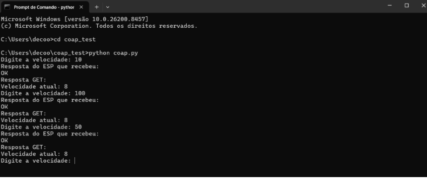
*Figura - Prompt, cliente*

*Fonte : Autoria própria*

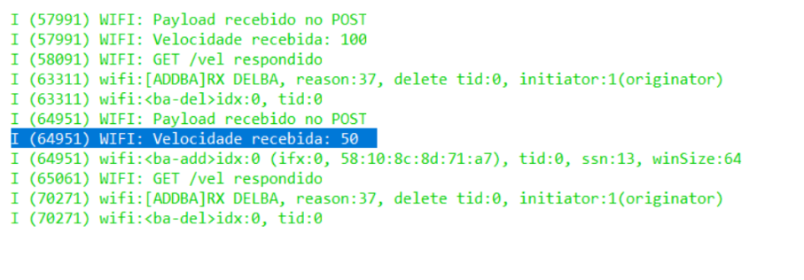
*Figura - Terminal esp-idf*

*Fonte : Autoria própria*

Testes
======

Descrição dos testes/validações realizadas.

(Outras subseções se necessário)
================================

Referências (links/datasheets/livros)
*************************************

- `nRF Connect SDK <https://developer.nordicsemi.com/nRF_Connect_SDK/doc/2.4.2/nrf/getting_started/modifying.html#configure-application>`_

INFINEON TECHNOLOGIES AG. NovalithIC™ H-Bridge Demo Board: Version 2.2 (BTN89xxTA) – Demo Board Description. Munich: Infineon Technologies AG, 2011. Disponível em: https://www.infineon.com/assets/row/public/documents/10/57/novalithic-demoboard-v2.2-h-bridge-btn89xxta-2011-09-23.pdf. Acesso em: 27 maio 2026.

ALTIUM. IPC-2221 Calculator for PCB Trace Current and Heating. Altium Resources, 26 jun. 2025. Disponível em: https://resources.altium.com/p/ipc-2221-calculator-pcb-trace-current-and-heating. Acesso em: 27 mai. 2026.

