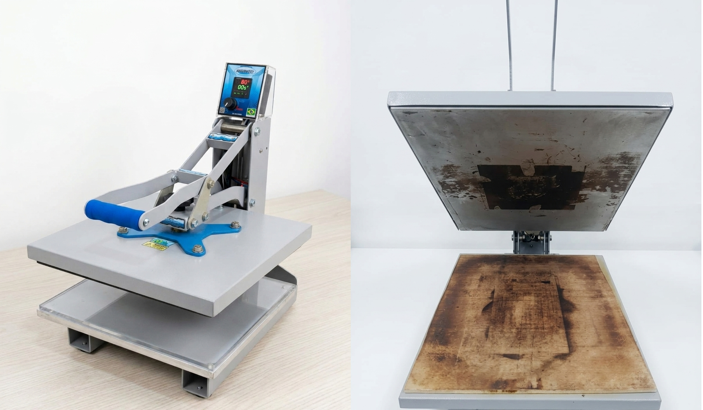
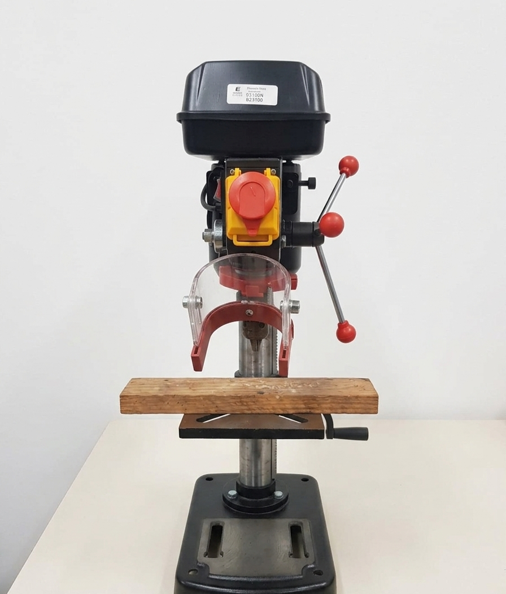
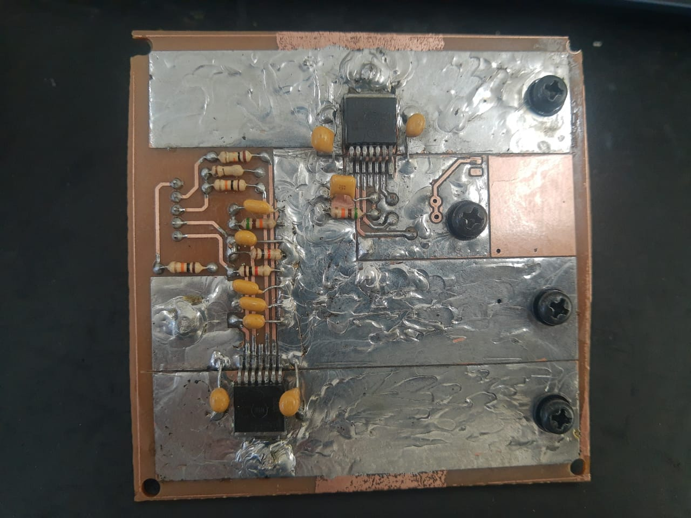
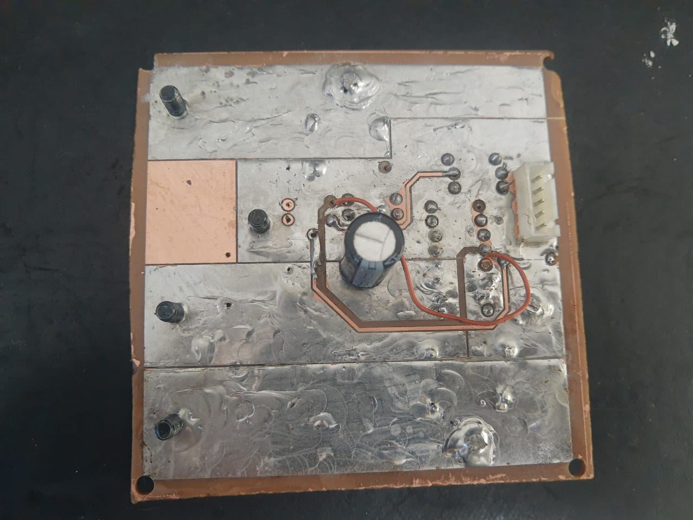

Etapa 4
#######

.. contents:: Sumário
   :local:
   :depth: 3

1. Visão geral
**************

A quarta e última etapa deste projeto consolida o desenvolvimento do sistema, resultando na entrega de um protótipo físico e operacional em estado alfa. Esta fase materializa as características e funcionalidades idealizadas no escopo inicial do projeto. O escopo desta etapa compreende a confecção da placa de circuito impresso (PCI), a manufatura aditiva do gabinete via impressão 3D, a integração do firmware definitivo, a execução dos testes de validação e, por fim, a análise crítica dos resultados obtidos.

2. Desenvolvimento
******************

2.1 Fabricação da PCI
====================================================================================

2.1.1 Transferência térmica
---------------------------

*Figura 1  – Prensa térmica*

*Fonte: Autoria própria*

2.1.2 Corrosão
--------------

Nesta etapa, o percloreto de ferro...

2.1.3 Furação
-------------

*Figura 1  – Furadeira de bancada*

*Fonte: Autoria própria*

2.1.4 Solda
-----------

*Figura 1  – PCI camada inferior*

*Fonte: Autoria própria*

*Figura 1  – PCI camada superior*

*Fonte: Autoria própria*

2.1.5 Problemática
------------------

.. image:: Prob2.jpeg
   :width: 800px
   :align: center
*Figura 1  – Tentativa falha de solda*

*Fonte: Autoria própria*

.. image:: Prob1.jpeg
   :width: 800px
   :align: center
*Figura 1  – Excesso de temperatura e carbonização da PCI*

*Fonte: Autoria própria*

2.2 Apresentação do gabinete confeccionado em impressão 3D e sistema final acomodado
====================================================================================

2.2.1 Processo de impressão
---------------------------

Descrição do processo...

2.2.2 Problemática
------------------

.. image:: AcomodacaoRuim.jpeg
   :width: 800px
   :align: center
*Figura 1  – Incompatibilidade de espaço e posicionamento ruim das PCIs*

*Fonte: Autoria própria*

2.2.3 Alterações técnicas no design do gabinete
-----------------------------------------------

.. image:: Gabinete.png
   :width: 800px
   :align: center
*Figura 1  – Alterações técnicas para melhoria de design do gabinete*

*Fonte: Autoria própria*

.. image:: Case3.jpeg
   :width: 800px
   :align: center
*Figura 1  – Acessórios do gabinete*

*Fonte: Autoria própria*

2.2.4 Apresentação definitiva do gabinete
-----------------------------------------

Resultados do gabinete...

2.2.5 Apresentação definitiva do sistema acomodado
--------------------------------------------------

Resultados do sistema...

2.3 Integração dos módulos de software e firmware final
=======================================================

2.3.1 Firmware definitivo
-------------------------

Descrição do firmware definitivo...

3. Testes de validação
**********************

3.1 Acionamento remoto
======================

Descrição do teste de acionamento remoto...

3.2 Controle de velocidade
==========================

Descrição do controle de velocidade...

3.3 Proteção de sobrecarga
==========================

Descrição da proteção de sobrecarga...

3.4 Inversão de sentido
=======================

Descrição do teste de inversão de sentido...

4. Resultados finais
********************

4.1 Comparação entre resultados esperados e obtidos
===================================================

Descrição da comparação entre os resultados...

5. Referências (links/datasheets/livros)
****************************************

* `nRF Connect SDK <https://developer.nordicsemi.com/nRF_Connect_SDK/doc/2.4.2/nrf/getting_started/modifying.html#configure-application>`_
