Etapa 4
#######

.. contents:: Sumário
   :local:
   :depth: 3

1. Visão geral
**************

A quarta e última etapa deste projeto consolida o desenvolvimento do sistema, resultando na entrega de um protótipo físico e operacional em estado alfa. Esta fase materializa as características e funcionalidades idealizadas no escopo inicial do projeto. Esta etapa compreende:

📌 Confecção da placa de circuito impresso (PCI)

📌 Manufatura aditiva do gabinete via impressão 3D

📌 Apresentação do Sistema Acomodado em Gabinete

📌 Teste de Sobrecarga e Acionamento

📌 Teste de controle de velocidade remoto do sistema

📌Comparação entre resultados obtidos e esperados

É inerente dizer que equívocos e imperícias ocorreram ao longo do desenvolvimento do projeto e que soluções alternativas foram incorporadas para atingir o objetivo final e o sucesso do trabalho.

2. Desenvolvimento
******************

2.1 Fabricação da PCI
====================================================================================

2.1.1 Problemática
------------------

O processo de soldagem dos drivers SMD BTN8982TA constituiu o primeiro desafio na montagem da PCI. Inicialmente, a baixa aderência do terminal de potência — que atua também como base de dissipação térmica — exigiu a aplicação de um volume excessivo de solda para assegurar o contato elétrico.
Durante a soldagem individual dos demais pinos, realizada sob aplicação de fluxo, ocorreu um curto-circuito entre os pinos 6 (IS) e 7 (VCC). Como a remoção do curto-circuito não foi bem-sucedida, os componentes foram removidos para a realização de uma nova tentativa de soldagem. Ressalta-se que o layout da PCI não previu a implementação de vias de alívio térmico sob o pino de potência. A Figura 1 ilustra o relato da primeira soldagem realizada.

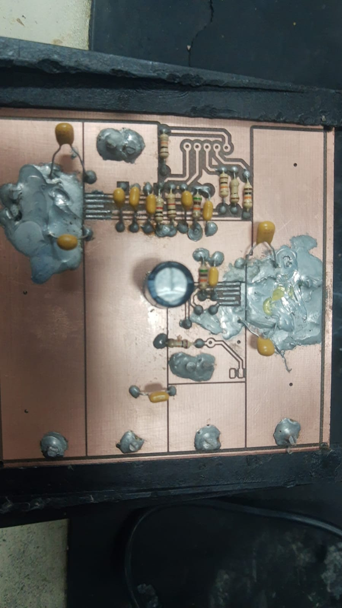
*Figura 1  – Tentativa falha de solda*

Com os componentes posicionados e pressionados por meio de uma pinça, a placa foi colocada na mesa de solda a uma temperatura de até 320 °C. Embora a soldagem inicial tenha sido bem-sucedida, uma inspeção visual detalhada identificou um curto-circuito entre os pinos 1 (GND) e 2 (PWM). Durante a tentativa de correção desse curto diretamente na mesa aquecida, a placa sofreu superaquecimento. A temperatura excedeu o limite suportado pelo substrato de fibra de vidro (temperatura de transição vítrea), resultando na carbonização da placa, como ilustrado na Figura 2.

*Fonte: Autoria própria*

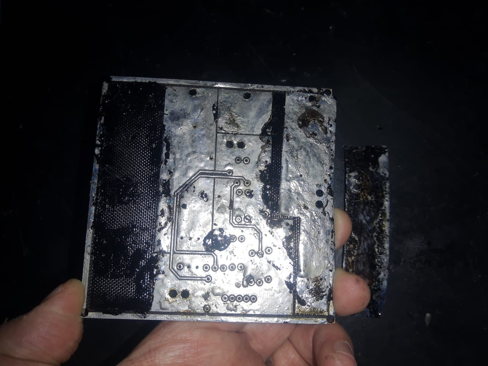
*Figura 2  – Excesso de temperatura e carbonização da PCI*

*Fonte: Autoria própria*

2.1.2 Transferência térmica, corrosão e furação
---------------------------

Após a inutilização do primeiro protótipo, viabilizou-se a confecção de uma segunda placa de circuito impresso a partir do zero. Para esta nova tentativa, substituiu-se o substrato original de fibra de vidro (FR-4) por uma placa de fenolite. O procedimento de manufatura manual iniciou-se com a preparação da superfície de cobre, utilizando lã de aço para a remoção da camada oxidada e álcool isopropílico para eliminar resíduos de cola ou outros detritos que pudessem comprometer a aderência na etapa de transferência térmica. Na sequência, a placa foi devidamente medida e cortada com base nas dimensões finais especificadas no projeto.

A transferência térmica foi realizada empregando papel fotográfico (glossy), que apresenta propriedades ideais para a prototipagem manual de PCIs. A impressão em PDF foi configurada conforme as diretrizes recomendadas pela secretaria do DAELN, aplicando o espelhamento correto em uma das faces para viabilizar a sobreposição precisa em dupla face. Utilizando a prensa térmica disponível no LPEE, efetuou-se a transferência de um lado por vez a uma temperatura de 180 °C com duração de 5 minutos, posicionando uma manta térmica sobre o conjunto para distribuir o calor uniformemente e evitar a carbonização do fenolite. Após a prensagem da primeira face, executaram-se até três pequenos furos guia apenas para garantir a centralização e o perfeito alinhamento entre as duas camadas. O posicionamento foi validado transpassando-se pedaços de fio metálico pelas vias e fixando o papel do lado reverso com fita adesiva para a prensagem final. Concluída a transferência de ambas as faces, realizou-se uma inspeção visual detalhada, corrigindo-se pequenas imperfeições no toner com uma caneta permanente para CD/DVD.

Com o circuito desenhado e protegido pelas trilhas de toner, a placa foi submetida ao processo de corrosão química por meio da imersão em uma solução de percloreto de ferro. Essa etapa, que durou cerca de 1 hora, removeu o cobre exposto e preservou apenas as regiões protegidas pela tinta. Finalizado o ataque químico, a placa foi lavada abundantemente em água corrente para neutralizar o agente corrosivo e devidamente secada. Toda a tinta protetiva restante foi removida novamente com lã de aço para expor o cobre limpo. Por fim, o circuito foi levado à furadeira de bancada, onde se utilizou broca de 0,8 mm para os furos de menor diâmetro e broca de 3,0 mm para os furos de fixação e maior diâmetro, deixando a placa de fenolite perfeitamente usinada e pronta para a etapa de soldagem dos componentes eletrônicos.

O processo completo descrito pode ser visto na Figura 3.

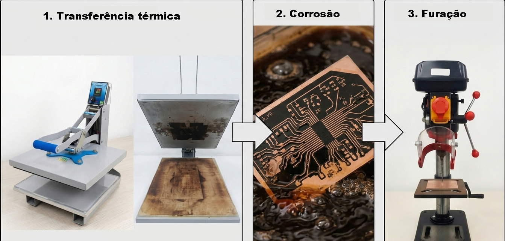
*Figura 3  – Transferência térmica, corrosão e furação*

*Fonte: Figura gerada por inteligência artificial*

2.1.3 Processo de soldagem
-----------

O processo de soldagem foi iniciado pela fixação dos dispositivos de montagem em superfície (SMD). Para essa etapa, utilizou-se uma estação de ar quente (hot air), ferro de solda com ponta fina, lupa de bancada, pasta de solda e fluxo de solda em abundância. Como todas as trilhas e terminais já haviam sido previamente estanhados, a transferência de calor ocorreu de forma rápida e localizada. O procedimento foi executado com cautela, evitando o estresse térmico do substrato de fenolite e prevenindo a formação de curtos-circuitos entre os terminais dos circuitos integrados. Na sequência, realizou-se a soldagem dos componentes de furo passante (PTH) com sucesso, seguida da remoção de seus respectivos terminais. Para finalizar a montagem física, realizou-se a limpeza completa da placa com álcool isopropílico para a eliminação de resíduos de fluxo.

A disposição dos componentes foi planejada estrategicamente devido às limitações de espaço da placa. A face superior (top) concentrou os componentes de maior volume físico, especificamente o capacitor eletrolítico e o conector de controle, enquanto a face inferior (bottom) abrigou os drivers de potência (SMD) e os componentes passivos. Embora o estanhamento manual realizado com ferro de solda apresente um aspecto visual rugoso e irregular — diferentemente do acabamento perfeitamente plano obtido em fornos de refusão industrial —, essa característica não compromete o funcionamento do circuito. Pelo contrário, a maior espessura da camada de liga de estanho depositada reduz a resistência elétrica das pistas (permitindo maior capacidade de corrente), oferece proteção extra contra a oxidação do cobre, aumenta a robustez mecânica das trilhas e melhora a dissipação térmica global devido ao aumento da área de superfície exposta.

Durante o processo, identificou-se o rompimento de uma das trilhas de controle no ponto de transição da face inferior para a face superior. A continuidade elétrica do circuito foi prontamente restabelecida por meio de um by-pass, soldando-se um condutor de cobre diretamente entre as extremidades íntegras da trilha interrompida. Devido à ausência de processos industriais para a metalização de furos nas dependências do IFSC, a interligação das camadas (vias) foi realizada de forma manual. Esse método gerou pequenas sobressalências de solda e fios nas faces da placa, sem prejuízo à integridade do circuito.

Visando garantir a robustez necessária os barramentos de potência foram reforçados com condutores de cobre de seção transversal de 4mm soldados ao longo de cada uma das faces da placa. A maioria dos componentes também foram soldados em ambas as extremidades para maximizar a área de contato elétrico. Já as trilhas de controle foram confeccionadas utilizando condutores extraídos de cabos de rede de par trançado (UTP), soldados seguindo a mesma metodologia das vias de potência. As trilhas de uso futuro foram preservadas isoladas e não receberam deposição de solda ou componentes. Por fim, a conexão física para a entrada e saída de potência foi solucionada com a implementação de parafusos de rosca M3 com porcas, atuando como bornes de fixação mecânica. Essa solução apresentou resistência de contato extremamente baixa (na ordem de dezenas de miliohms), garantindo que não houvesse quedas de tensão significativas ou dissipação excessiva por efeito Joule, validando a eficácia e a segurança do sistema sob operação.

O resultado do processo de soldagem das duas faces pode ser visto na Figura 4. Na mesma Figura uma legenda identifica cada uma dos elementos discutidos.

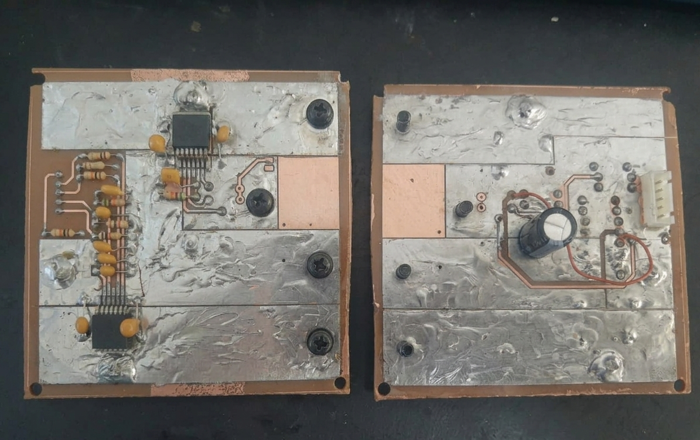
*Figura 4  – PCI após solda da camada inferior e superior*

*Fonte: Figura com auxílio de inteligência artificial*

2.2 Apresentação do gabinete confeccionado em impressão 3D e sistema final acomodado
====================================================================================

2.2.1 Problemática
------------------

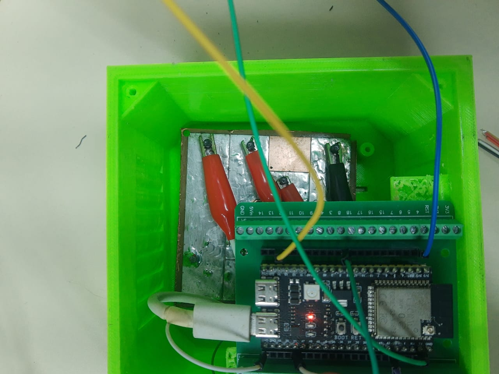
*Figura 1  – Incompatibilidade de espaço e posicionamento ruim das PCIs*

*Fonte: Autoria própria*

2.2.2 Processo de impressão
---------------------------

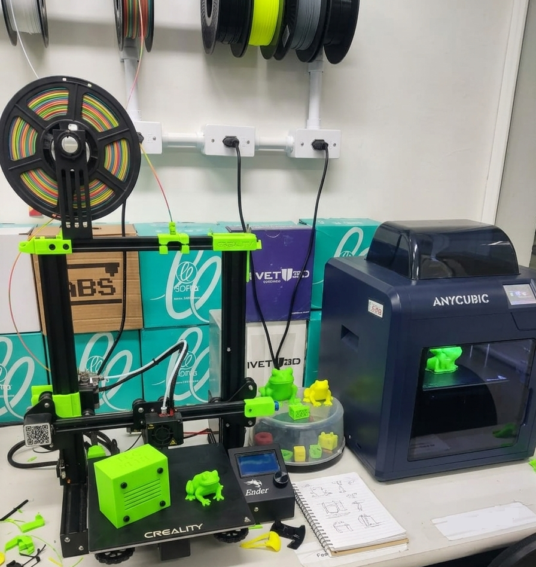
*Figura 1  – Impressoras utilizadas para impressão 3D*

*Fonte: Autoria própria*

2.2.3 Alterações técnicas no design do gabinete
-----------------------------------------------

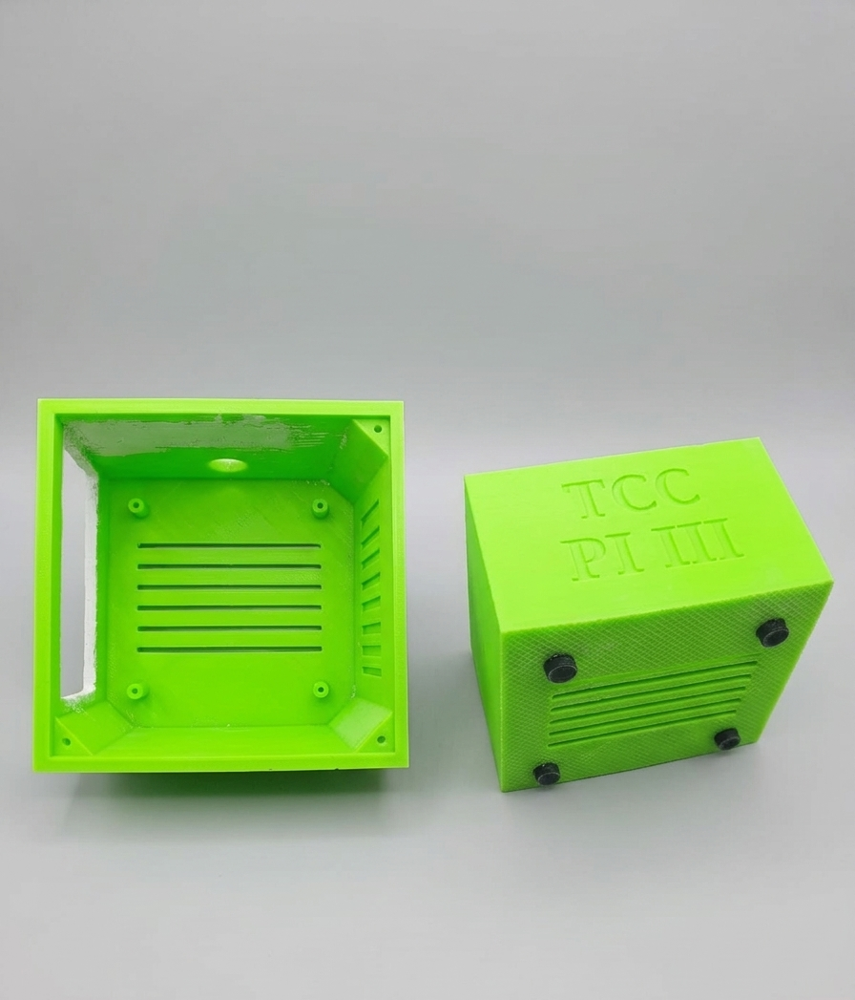
*Figura 1  – Alterações técnicas para melhoria de design do gabinete*

*Fonte: Autoria própria*

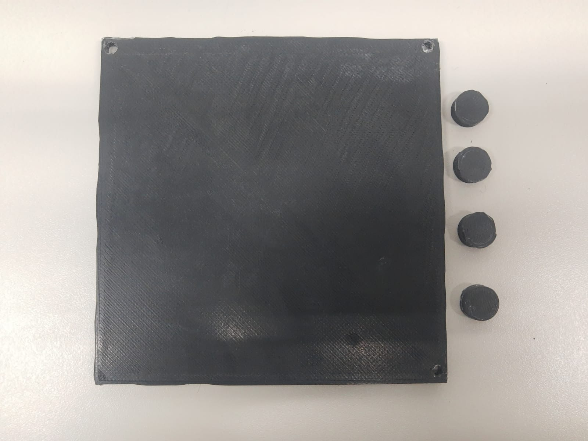
*Figura 1  – Acessórios do gabinete*

*Fonte: Autoria própria*

2.2.4 Apresentação definitiva do gabinete
-----------------------------------------

Resultados do gabinete...

2.2.5 Apresentação definitiva do sistema acomodado
--------------------------------------------------

Resultados do sistema...

2.3 Teste de Sobrecarga e Acionamento do Motor
=======================================================

O teste de acionamento do motor utilizando o driver confeccionado ocorreu com sucesso. Para realizar este teste foi utilizada uma fonte de bancada com duas tensões independentes, 24V e 5V, ambas com limitações de 2A. 

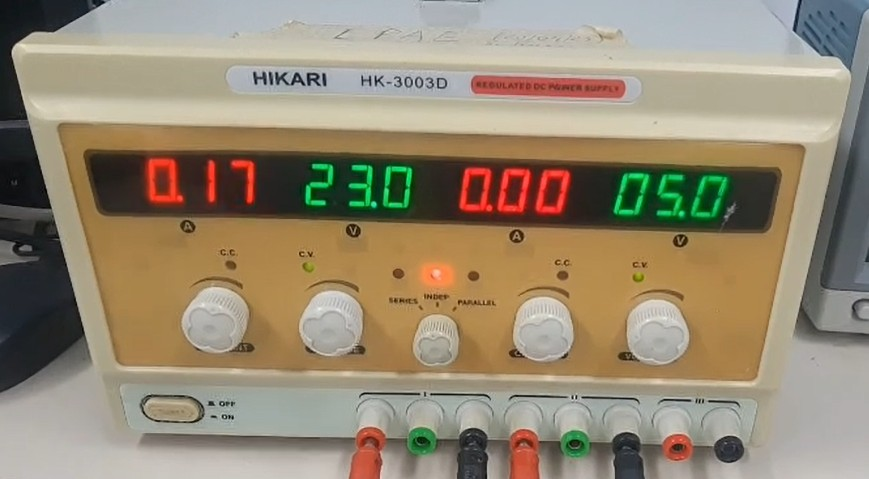
*Figura 1  – Configuração da Fonte de Bancada*

*Fonte: Autoria própria*

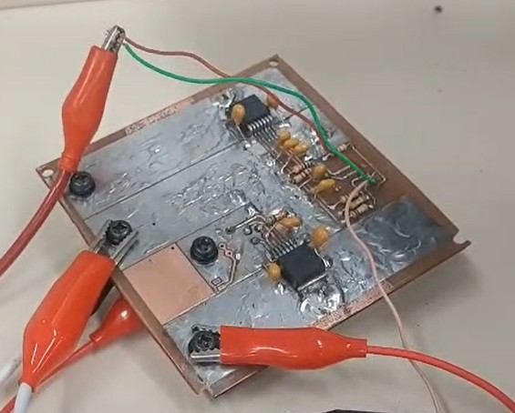
*Figura 1  – Em destaque o Driver*

*Fonte: Autoria própria*

Esse teste foi feito para conferir se o driver estava funcionando corretamente ao ligar na fonte de alimentação. E funcionou, a esteira foi acionada pelo driver, como pode ser visto no gif abaixo:

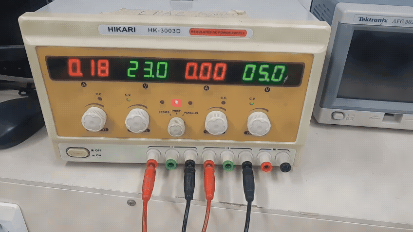
*Figura 1  – Funcionamento do driver ao ligar na fonte de alimentação*

*Fonte: Autoria própria*

O teste de sobrecarga foi feito adicionando pesos à esteira juntamente com o código de controle e monitoramento remoto da velocidade da esteira, o intuito deste teste foi verificar o comportamento da esteira quando é exigida sua potência máxima. Então foi definida a velocidade máxima de 60 RPM, e com a adição de pesos o que ocorreu foi o aumento da corrente na fonte de alimentação para manter essa velocidade. Como a fonte de alimentação estava com proteção para 2A, funcionou normalmente. Podendo ser visualizado nas 4 imagens seguintes que representam a medição do RPM da esteira sem peso e a medição do RPM após a adição do peso excedente.
Essas 4 imagens foram capturas do vídeo que mostra esse comportamento. 
O vídeo está nesse repositório na pasta Imagens, e pode ser acessado com este link: https://github.com/pepeu321/PI3_26.1/blob/main/etapa_4/Imagens/Sobrecarga.mp4 

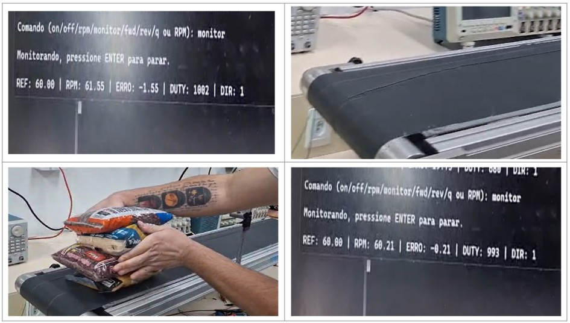
*Figura 1  – Teste de Sobrecarga*

*Fonte: Autoria própria*

Então como pode ser visto, o sistema inicialmente tinha uma velocidade de 61,55 RPM (o que é um valor aceitável para um RPM definido de 60RPM) e acomodou-se com 60,21 RPM. Com o detalhe do aumento da fonte de corrente na fonte de bancada. Mais explicações sobre o código de controle e medição do RPM remoto serão vistos a seguir.

2.4 Teste de Controle Remoto do Sistema
=======================================================

O ponto de partida para realização desta tarefa foi a realização de novos testes para obtenção da planta da esteira, porque a curva obtida na etapa anterior apresentou algumas leituras dos valores de RPM inconsistentes. E Foi necessário fazer uma “filtragem” desses valores muito divergentes para obter uma curva de resposta ao degrau mais “limpa”. Com isso, a obtença da nova planta para o motor da esteira é interessante, pois o controle será PID, então ter um modelo mais "exato" da planta ajudará em seu controle.

2.4.1 Obtenção de uma planta melhor
---------------------------

O procedimento foi repetido conforme descrito na etapa anterior: a fonte de alimentação foi ajustada para 12 V, sendo aplicada uma entrada em degrau ao motor da esteira, enquanto os valores de RPM foram coletados. Como melhoria em relação aos testes anteriores, o período de amostragem foi ajustado para 100 ms, proporcionando uma aquisição de dados mais consistente para a identificação da planta.

Foram 5 medições, as curvas dos valores obtidos podem ser vistas neste gráfico:

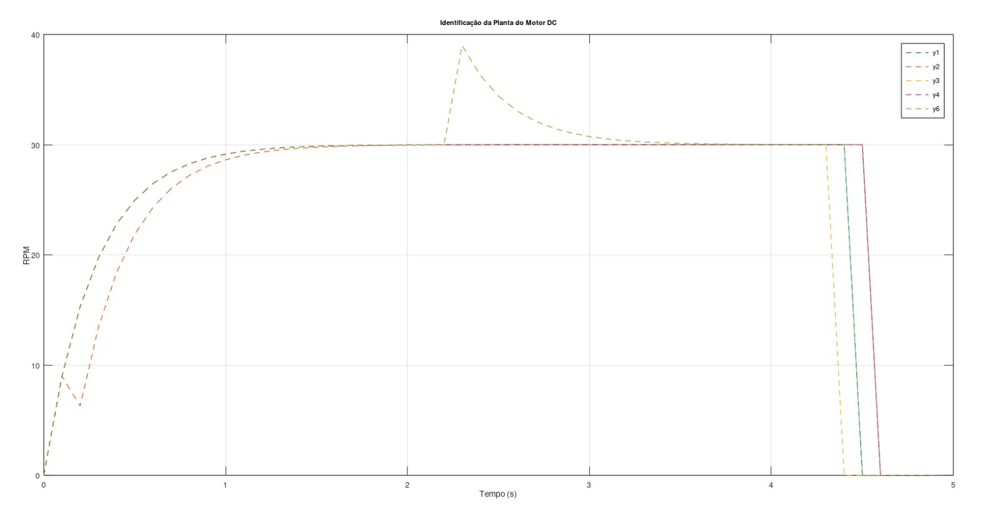
*Figura 1  – Novas medições para obtenção da planta da esteira*

*Fonte: Autoria própria*

Como pode ser visualizado no gráfico anterior, as curvas já são muito melhores, com curvas coincidentes. Ainda há presença de dois pontos com leituras de RPM inconsistentes, mas muito pouco em relação a curva inteira e ainda muito menor com relação a curva obtida na etapa anterior.
Com a curva da média dessas medições foi encontrada uma curva de resposta ao degrau da esteira, conforme a figura abaixo.

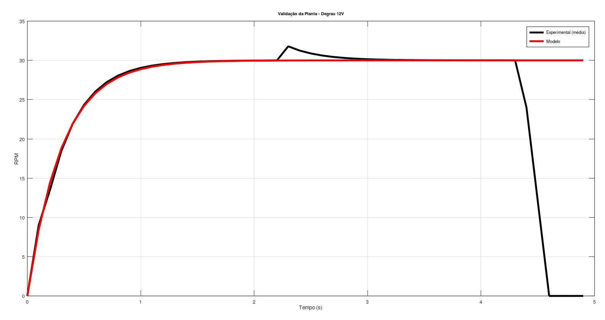
*Figura 1  – Curva da Média das medições e da nova planta obtida*

*Fonte: Autoria própria*

**Planta obtida: 2,5/(0,305*s +1)**

O tau encontrado é de 0,305 segundos, muito próximo do valor anteriormente encontrado, de 0,291 segundos. Um erro aproximado de 4,6 %.

Isso indica que nossas observações sobre as inconsistências nas leituras e a filtragem desses valores estava correta. 

2.4.2 Novo Projeto de Controle PID
---------------------------

Foi definido um novo controle PID com sobressinal de 10%, e tempo de acomodação de 0,4s. 

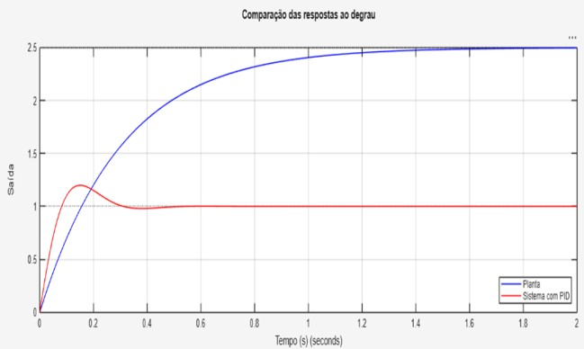
*Figura 1  – Curva de resposta ao degrau da planta original e com ação do PID*

*Fonte: Autoria própria*

Conforme o gráfico acima, o controle PID melhora bastante o tempo de resposta e o erro de regime permanente. Esse projeto fornece os valores bases de Kp e Ki, que podem ser ajustados posteriormente no código para ajustar a ação de controle posteriormente, um ajuste fino. 

**Kp = 2,04**

**Ki = 34,91**

Estes valores e gráficos foram obtidos com o seguinte script matlab:

.. code-block:: c

   clear
   clc
   close all
   
   s = tf('s');
   
   %% Planta
   G = 2.5/(0.305*s+1);
   
   %% Especificações
   Mp = 0.10;
   Ts = 0.40;
   
   zeta = -log(Mp)/sqrt(pi^2+log(Mp)^2);
   wn = 4/(zeta*Ts);
   
   %% Projeto do controlador
   Kd = 0;
   
   Kp = (2*zeta*wn*(0.305+2.5*Kd)-1)/2.5;
   Ki = ((wn^2)*(0.305+2.5*Kd))/2.5;
   
   C = pid(Kp,Ki,Kd);
   
   %% Exibir ganhos do PID
   
   fprintf('\n==============================\n');
   fprintf('GANHOS DO CONTROLADOR PID\n');
   fprintf('==============================\n');
   fprintf('Kp = %.6f\n', Kp);
   fprintf('Ki = %.6f\n', Ki);
   fprintf('Kd = %.6f\n', Kd);
   fprintf('------------------------------\n');
   fprintf('zeta = %.6f\n', zeta);
   fprintf('wn = %.6f rad/s\n', wn);
   fprintf('==============================\n\n');
   
   %% Malha fechada
   T = feedback(C*G,1);
   
   %% Comparação
   
   figure
   step(G,'b',T,'r',2)
   grid on
   legend('Planta','Sistema com PID','Location','southeast')
   title('Comparação das respostas ao degrau')
   xlabel('Tempo (s)')
   ylabel('Saída')
   
   %% Informações da resposta
   
   disp('Informações da resposta do sistema controlado:')
   stepinfo(T)

2.4.3 Melhora na leitura do RPM
---------------------------

Uma parte crucial para o funcionamento correto da ação de controle é a leitura dos RPM's, porque leituras inconsistentes farão com que a ação de controle sempre "atue", ou seja, o sistema ficará sempre gerando respostas ao degrau para obter o rpm desejado. Nunca se estabelecerá uma velocidade constante. 

Para vencer este problema foi necessário mudar a estratégia de leitura dos RPM's. No código anterior a contagem do RPM depende do número de pulsos contados em um intervalo de tempo, mas como a velocidade da esteira é relativamente baixa, de 0 a 60 RPM. É bem possível que haja saltos na contagem de pulsos nesse período, por exemplo: para uma velocidade de 30 RPM(meia volta por segundo), como o encoder utilizado tem 20 ranhuras, meia volta significa 10 ranhuras/pulsos. Então para a velocidade de meia volta por segundo, em 1 segundo caso o período de amostragem utilizado for 100 ms, o que se espera a cada amostragem é que seja contabilizado exatamente 1 pulso. Porém isso pode não acontecer, em algumas leituras será contabilizado 0, em outras 2, e não necessariamente 1 pulso em cada amostragem.

Demonstrando: 

Meia volta por segundo = 10 pulsos por segundo

Período de amostragem = 100 ms

Número de amostras em 1 segundo -> 10 amostras

**Linha do tempo (1 segundo)**

.. code-block:: c

   Tempo (ms)
   0      100    200    300    400    500    600    700    800    900   1000
   |-------|------|------|------|------|------|------|------|------|------|
   
   Período de amostragem = 100 ms
   Número de amostras = 10

**Situação Ideal** 

.. code-block:: c

   Contagem de pulsos por amostra
   
   Amostra:   1   2   3   4   5   6   7   8   9   10
              |   |   |   |   |   |   |   |   |    |
   Pulsos:    1   1   1   1   1   1   1   1   1    1
   
   Total = 10 pulsos

**Situação Real**

.. code-block:: c

   Contagem de pulsos por amostra
   
   Amostra:   1   2   3   4   5   6   7   8   9   10
              |   |   |   |   |   |   |   |   |    |
   Pulsos:    1   0   2   1   1   0   2   1   1    1
   
   Total = 10 pulsos

Esse problema é ainda maior com períodos de amostragem menores, porque serão contabilizados muitos 0's. Então a estratégia adotada para vencer este problema foi contar o tempo do intervalo entre os pulsos. A velocidade não é alta(0 a 60 RPM), então não comprometerá o hardware nessa contagem de tempo.

O código wheel.c e wheel.h precisou ser alterado: 

**wheel.h**

.. code-block:: c

   #ifndef MAIN_WHEEL_H_
   #define MAIN_WHEEL_H_
   
   #include "driver/pulse_cnt.h"  //periférico PCNT do ESP32
   
   // GPIO do encoder
   #define ENCODER_GPIO 14
   
   void wheel_Init(void);
   void wheel_UpdateRPM(void);
   float wheel_GetRPM(void);
   
   #endif

**wheel.c**

.. code-block:: c

   #include "wheel.h"
   #include "esp_log.h"
   #include "esp_timer.h"
   #include "esp_err.h"
   
   static const char *TAG = "WHEEL"; 
   
   static pcnt_unit_handle_t pcnt_unit = NULL;  //Handle do PCNT
   
   #define PULSOS_POR_VOLTA 20
   
   static int last_count = 0;  //Guardar contagem anterior
   static int64_t last_pulse_time = 0;  //Guardar instante do último pulso
   
   static float rpm = 0;  //RPM filtrado atual
   
   // INIT- configuracao do periferico
   void wheel_Init(void)
   {
       ESP_LOGI(TAG, "Inicializando PCNT...");
   
       pcnt_unit_config_t unit_config = {
           .low_limit  = -32768,  //faixa de contagem contador
           .high_limit = 32767,
           .flags = {
               .accum_count = true, //acumula no limite ao inves de reiniciar
           },
       };
   
       ESP_ERROR_CHECK(pcnt_new_unit(&unit_config, &pcnt_unit));
   
       pcnt_channel_handle_t chan = NULL;
   
       pcnt_chan_config_t chan_config = {  //Criacao do canal
           .edge_gpio_num = ENCODER_GPIO, //deteccao de borda
           .level_gpio_num = -1,
       };
   
       ESP_ERROR_CHECK(pcnt_new_channel(pcnt_unit, &chan_config, &chan));
   
       ESP_ERROR_CHECK(pcnt_channel_set_edge_action(chan,
           PCNT_CHANNEL_EDGE_ACTION_INCREASE,  //incrementa contador na borda
           PCNT_CHANNEL_EDGE_ACTION_HOLD));
   
       ESP_ERROR_CHECK(pcnt_channel_set_level_action(chan,
           PCNT_CHANNEL_LEVEL_ACTION_KEEP,
           PCNT_CHANNEL_LEVEL_ACTION_KEEP));
   
       pcnt_glitch_filter_config_t filter_config = {
           .max_glitch_ns = 2000, //Filtro anti-ruído
       };
   
       ESP_ERROR_CHECK(pcnt_unit_set_glitch_filter(pcnt_unit, &filter_config));
   
       ESP_ERROR_CHECK(pcnt_unit_enable(pcnt_unit)); //habilita
       ESP_ERROR_CHECK(pcnt_unit_clear_count(pcnt_unit)); //zera
       ESP_ERROR_CHECK(pcnt_unit_start(pcnt_unit)); //comeca contagem
   
       last_pulse_time = esp_timer_get_time();
   
       ESP_LOGI(TAG, "Encoder inicializado");
   }
   
   // UPDATE RPM (TEMPO ENTRE PULSOS)
   void wheel_UpdateRPM(void)
   {
       int count = 0;
   
       if (pcnt_unit_get_count(pcnt_unit, &count) != ESP_OK) //le total de pulsos acumulados
           return;
   
       int delta = count - last_count; //Verifica quantos pulsos chegaram desde a ultima chamada.
   
       if (delta > 0)
       {
           int64_t now = esp_timer_get_time(); 
           int64_t dt_us = now - last_pulse_time; //Mede tempo entre pulsos
   
           last_pulse_time = now;
           last_count = count;
   
           if (dt_us > 0)
           {
               float dt = dt_us / 1000000.0f; //Conversao para segundos
   
               float rpm_new = 60.0f / (dt * PULSOS_POR_VOLTA); //Formula do RPM
   
               // filtro IIR de primeira ordem (80% valor antigo e 20% valor novo )
               rpm = 0.8f * rpm + 0.2f * rpm_new;
           }
       }
       else
       {
           // Detectacao de parada  (sem pulsos por 2s)
           int64_t now = esp_timer_get_time();
   
           if ((now - last_pulse_time) > 2000000)
           {
               rpm = 0;
           }
       }
   }
   
   // retorna RPM
   float wheel_GetRPM(void)
   {
       return rpm;
   }

O que se destaca nesse código é a mudança na estratégia de cálculo da velocidade. Em vez de contar o número de pulsos em um intervalo fixo de tempo, a velocidade passa a ser calculada a partir do tempo entre dois pulsos consecutivos do encoder. À cada execução da função wheel_UpdateRPM() é verificado se o contador do PCNT foi incrementado (delta > 0). Quando isso ocorre, o instante atual é obtido por meio da função esp_timer_get_time(), e a diferença em relação ao tempo armazenado em last_pulse_time fornece o período entre dois pulsos consecutivos. Esse período é então convertido para segundos e utilizado para calcular a velocidade em RPM pela expressão 60/(dt × número de ranhuras do encoder).

Além disso, foi configurado o filtro de glitch do periférico PCNT por meio do parâmetro max_glitch_ns, de forma que pulsos incompatíveis com a velocidade máxima de operação da esteira (considerando uma margem de aproximadamente 70 RPM) sejam descartados, reduzindo a influência de ruídos na medição.

Por fim, caso nenhuma variação seja detectada na contagem do PCNT (delta = 0), o código verifica o tempo decorrido desde o último pulso. Se esse intervalo ultrapassar 2 segundos, a variável rpm é atualizada para zero, indicando que o motor está parado.

2.3.1 Firmware definitivo
-------------------------

Descrição do firmware definitivo...

3. Testes de validação
**********************

3.1 Acionamento remoto
======================

MOSTRAR GIF DE ACIONAMENTO NORMAL E REMOTO DA ESTEIRA

3.2 Controle de velocidade
==========================

MOSTRAR GIF DE DIFERENTES VELOCIDADES ENVIADAS PELO O USUÁRIO E ALTERAÇÃO DE VELOCIDADE DA ESTEIRA

3.3 Proteção de sobrecarga
==========================

MOSTRAR GIF DA PROTEÇÃO DO SISTEMA VIA LIMITE DIGITAL APÓS SOBREPESO

3.4 Inversão de sentido
=======================

MOSTRAR GIF DO ACIONAMENTO PARA SENTIDO FRENTE E TRÁS

4. Resultados finais
********************

4.1 Comparação entre resultados esperados e obtidos
===================================================

COMPARAR CURVA DE CONTROLE DO DRIVER PRONTO COM O DRIVER CONFECCIONADO
COMPARAR CURVA DE CONTROLE OBTIDA COM O DRIVER CONFECCIONADO COM A CURVA DE CONTROLE IDEALIZADA E CALCULAR ERRO
FAZER TABELA DE ERRO PARA DIFERENTES VALORES DE VELOCIDADE E SEM CARGA
FAZER TABELA DE ERRO PARA DIFERENTES VALORES DE VELOCIDADE E CARGA BAIXA
FAZER TABELA DE ERRO PARA DIFERENTES VALORES DE VELOCIDADE E CARGA ALTA
FAZER TABELA PARA PESO MÁXIMO E VELOCIDADE PARA ERRO MÁXIMO PERMITIDO

4.2 Melhorias futuras
===================================================

Embora os requisitos do projeto tenham sido atendidos, foram identificadas diversas oportunidades de aprimoramento técnico e funcional. Essas propostas visam otimizar a eficiência, a segurança, o controle e a robustez do sistema, aproximando o protótipo atual de um produto final comercializável.

As melhorias sugeridas foram divididas em quatro pilares fundamentais:

4.2.1 Hardware, layout e fonte de alimentação
-------------------------

•	Desenvolvimento de fonte chaveada integrada: Substituição das fontes atuais por uma única fonte chaveada robusta com proteções integradas, capaz de se conectar diretamente à rede elétrica comercial (tomadas de até 20 A) e fornecer saídas reguladas de 3,3 V e 5 V (para microcontrolador e sensores), além de barramentos de 12 V e 24 V (para alimentação do driver, ventoinha e LEDs).

•	Manufatura industrial da PCI: Terceirização da fabricação da Placa de Circuito Impresso por empresas especializadas, reduzindo imperfeições de pistas e garantindo furações metalizadas (PTH) com acabamento profissional (máscara de solda e legenda).

•	Otimização de layout e integração com microcontrolador: Redesenho com foco em compacidade física e integração do microcontrolador diretamente na placa, utilizando componentes de montagem em superfície (SMD) na sua totalidade para viabilizar um projeto de face única.

•	Conectores e acabamento elétrico profissional: Substituição de fiações sobressalentes por um projeto profissional de chicote elétrico, empregando organizadores, espirais de proteção e conectores industriais com travas de segurança.

4.2.2 Eficiência térmica, ruído e iluminação
-------------------------

•	Gerenciamento térmico ativo: Adição de uma ventoinha controlada pelo sistema para acelerar a troca de calor e resfriar os componentes de potência (como os drivers), garantindo maior vida útil ao circuito.

•	Sinalização visual de alto brilho: Implementação de LEDs de alto brilho no gabinete para iluminação e visualização clara do funcionamento interno do sistema.

•	Adequação às normas de EMI: Investigação e ensaios práticos sobre o ruído de interferência eletromagnética (EMI) gerado pelo circuito chaveado e pelo motor, seguidos de ações corretivas (filtros, blindagens e planos de terra adequados) para conformidade com as normas vigentes.

4.2.3 Sensoriamento, proteções e algoritmos de controle
-------------------------

•	Análise de grandezas: Implementação de algoritmos matemáticos no firmware para estimar e monitorar grandezas mecânicas e elétricas como torque instantâneo, peso total carregado, potência média e horas de operação.

•	Proteção por limite de corrente: Integração da leitura da corrente fornecida pelo driver com um mecanismo de segurança via by-pass por software, que limite ou interrompa a operação do motor caso uma sobrecorrente perigosa seja detectada.

•	Ajuste em baixas rotações: Ajuste específico do perfil de controle para garantir a estabilidade e o torque da esteira em velocidades excessivamente baixas (inferiores a 20 RPM).

•	Controle avançado e preditivo: Substituição de malhas clássicas de controle por malhas de controle preditivo, visando respostas mais dinâmicas e menor sobressinal diante de perturbações de carga.

4.2.4 Conectividade, interface e telemetria
-------------------------

•	Telemetria de dados: Criação de um sistema de geração e envio de logs de eventos e falhas em tempo real para armazenamento e visualização do usuário.

•	Controle remoto multipataforma: Desenvolvimento de uma aplicação móvel para acesso, monitoramento e controle dos parâmetros da esteira por meio de dispositivos móveis.

•	Conectividade de longa distância: Expansão da interface de rede local para uma arquitetura em nuvem (IoT), permitindo o acionamento e supervisão do sistema de forma remota a partir de qualquer rede externa.

5. Referências (links/datasheets/livros)
****************************************

* `nRF Connect SDK <https://developer.nordicsemi.com/nRF_Connect_SDK/doc/2.4.2/nrf/getting_started/modifying.html#configure-application>`_
